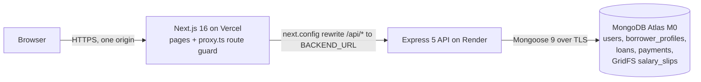
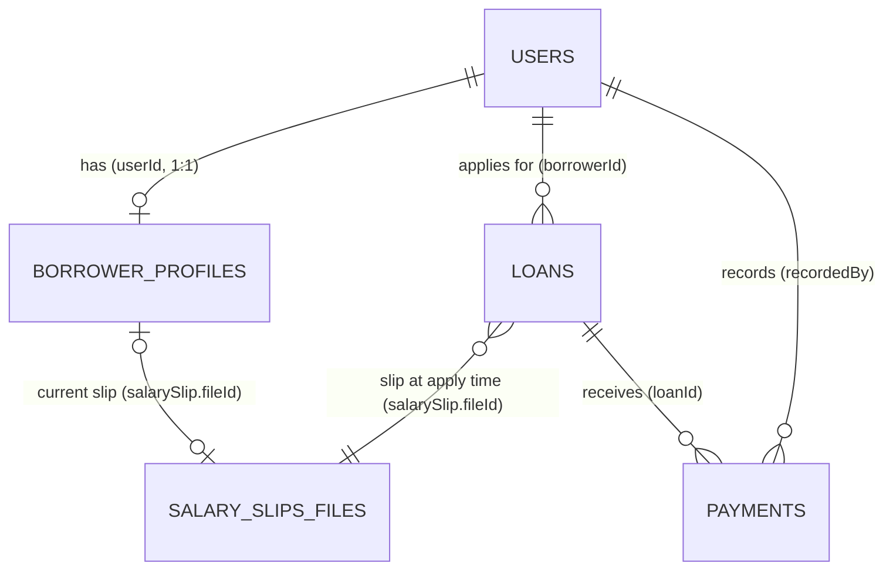
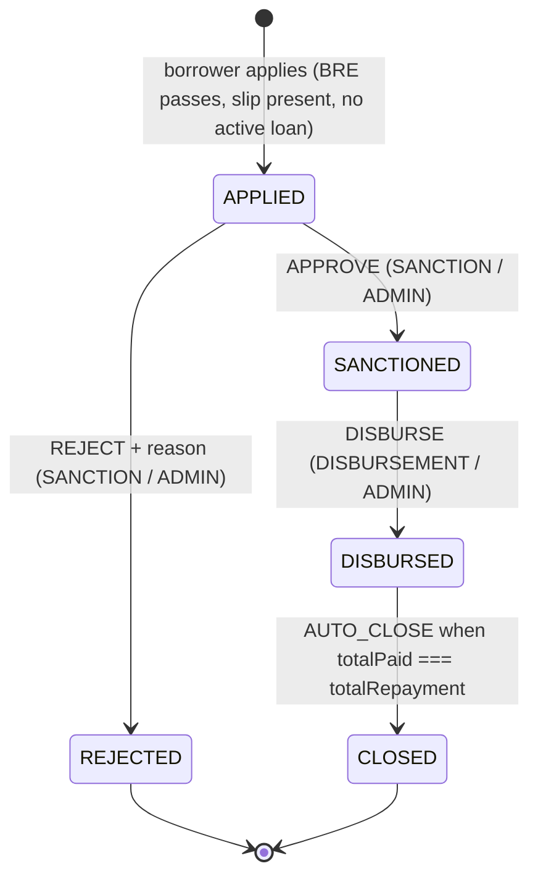

# PLAN.md — Loan Management System

> Status: **APPROVED (v2, 2026-10-10)**, with the compressed 8-branch plan in §15 and your answers in §16.
> Sources: `LMS_Assignment.pdf` (spec), your task prompt (technical decisions; wins on conflict), `CLAUDE.md` (rules).
> v2 adds the results of a multi-angle review of v1: spec coverage, security, data/backend, current tech facts and branch sequencing.

## 0. Goal and priority

A lending platform with two parts:

- **Borrower portal**: sign up → personal details (BRE check) → salary slip upload → loan configuration → apply → status page.
- **Operations dashboard**: Sales, Sanction, Disbursement and Collection modules, one per stage of the loan lifecycle. Each executive sees only their module; Admin sees all modules plus counts per status.

**Priority:** first make the end-to-end flow work (apply → BRE pass/fail → approve → disburse → pay → auto-close). Polish comes after. The grading weights are flow 35%, code quality 20%, BRE and math 15%, RBAC 15%, UI 10%, README 5%.

---

## 1. Architecture and stack



- The browser only talks to the Vercel domain. Next.js `rewrites` proxy `/api/*` to Render, so the JWT cookie is first-party (`httpOnly; SameSite=Lax; Secure`). `/api` never goes through `proxy.ts` or a route handler, because Vercel Functions cap request bodies at 4.5 MB and uploads can be up to 5 MB.
- Only the backend talks to MongoDB. Uploads go to GridFS, because Render's disk is wiped on every deploy.
- **Two independent npm packages** (`backend/`, `frontend/`), each with its own lockfile, plus a root `package.json` that holds only repo tooling. They are not npm workspaces, because Render and Vercel each build one sub-folder.

### Stack (majors fixed here; exact versions pinned in branch 1 with `save-exact`)

| Layer    | Choice                                                                                                                                                                                        | Notes                                                                                                                                |
| -------- | --------------------------------------------------------------------------------------------------------------------------------------------------------------------------------------------- | ------------------------------------------------------------------------------------------------------------------------------------ |
| Runtime  | Node **24 LTS** (`.nvmrc` = 24, `"engines": { "node": "24.x" }`)                                                                                                                              | Render's and Vercel's default                                                                                                        |
| Language | **TypeScript 6.0.x** (exact), both apps                                                                                                                                                       | Not 7.x (npm `latest`): typescript-eslint supports `<6.1.0`, and TS 7 has no JS API. Fallback 5.9.3 if Next 16 has trouble with 6.0. |
| Backend  | Express **5**, Mongoose **9**, zod **4**, jose 6, bcrypt 6, cookie-parser, helmet 8, cors, express-rate-limit 8, multer **2.4+**, file-type 22 (ESM), pino 10 + pino-http 11, tsx (dev)       | ESM (`"type": "module"`, `module: nodenext`) because file-type is ESM-only                                                           |
| Frontend | Next.js **16** (App Router), React 19, Tailwind **4**, zod 4, jose 6, sonner                                                                                                                  | `proxy.ts` (Next 16 renamed `middleware.ts`)                                                                                         |
| Tests    | vitest 5, supertest 7, mongodb-memory-server 11 (`MongoMemoryReplSet`, binary pinned to **8.0.x** = the version Atlas M0 runs)                                                                | Transactions need a replica set                                                                                                      |
| Tooling  | ESLint **9.39.x** flat config (not 10: eslint-config-next's plugins peer `≤9`), typescript-eslint 8, Prettier 3, husky 9, lint-staged 17, commitlint 21, gitleaks, Dependabot, GitHub Actions |                                                                                                                                      |

Version-specific rules the code follows:

- **Express 5**: `req.query` is a read-only getter, `req.body` is `undefined` when no body is sent, wildcards must be named, and rejected promises reach the error handler automatically (so there is no `async-handler.ts`).
- **Mongoose 9**: no `next()` in hooks, `returnDocument: 'after'` instead of `new: true`, filter types use `QueryFilter<T>`.
- **zod 4**: `z.strictObject()` (zod 4's form of `.strict()`), `z.email()`, `z.iso.date()`.

---

## 2. Data model

All money is **integer paise**. Date-only values (DOB, payment date) travel as `YYYY-MM-DD` strings (`CalendarDate`) and are stored as `Date` at UTC midnight. "Today" is always the calendar date in `Asia/Kolkata` (see §4.5).

### 2.1 Relationships



Every schema sets `collection` explicitly. Aggregations use `Model.collection.collectionName`, never a string literal.

### 2.2 `users`

| Field                    | Type        | Rules                                                                                                                        |
| ------------------------ | ----------- | ---------------------------------------------------------------------------------------------------------------------------- |
| `name`                   | string      | 2–80 chars, trimmed                                                                                                          |
| `email`                  | string      | unique, lowercased, trimmed                                                                                                  |
| `passwordHash`           | string      | bcrypt with **cost 10** (CLAUDE.md minimum; Render Free has 0.1 CPU), **`select: false`**, removed in `toJSON` as a backstop |
| `role`                   | enum `Role` | `ADMIN \| SALES \| SANCTION \| DISBURSEMENT \| COLLECTION \| BORROWER`. Public sign-up always sets `BORROWER`.               |
| `createdAt`, `updatedAt` | Date        |                                                                                                                              |

Indexes: `{ email: 1 }` unique · `{ role: 1, createdAt: -1, _id: -1 }` (Sales leads).

### 2.3 `borrower_profiles` (one per borrower)

| Field            | Type             | Rules                                                                                                                                                         |
| ---------------- | ---------------- | ------------------------------------------------------------------------------------------------------------------------------------------------------------- |
| `userId`         | ObjectId → users | unique                                                                                                                                                        |
| `fullName`       | string           | 2–100 chars                                                                                                                                                   |
| `pan`            | string           | trimmed and uppercased, at most 20 chars. The **format** is checked by the BRE, not zod, so a bad PAN appears in the failure list next to the other failures. |
| `dateOfBirth`    | Date             | UTC midnight                                                                                                                                                  |
| `monthlySalary`  | int paise        | 0 – `MAX_MONTHLY_SALARY_PAISE`                                                                                                                                |
| `employmentMode` | enum             | `SALARIED \| SELF_EMPLOYED \| UNEMPLOYED`                                                                                                                     |
| `breResult`      | object           | `{ isEligible, failures: [{ rule: 'AGE'\|'SALARY'\|'PAN'\|'EMPLOYMENT', message }], checkedAt }`                                                              |
| `salarySlip`     | object \| null   | `{ fileId (GridFS), contentType, sizeBytes, uploadedAt }`                                                                                                     |

Index: `{ userId: 1 }` unique.

**A failed BRE is still saved.** Sales needs a "BRE failed" lead stage, so the profile is saved with `isEligible: false` and the API still returns **422** with every failure. The application stays blocked until the borrower fixes the inputs.

### 2.4 `loans`

| Field                              | Type              | Rules                                                                                                                                                      |
| ---------------------------------- | ----------------- | ---------------------------------------------------------------------------------------------------------------------------------------------------------- |
| `borrowerId`                       | ObjectId → users  |                                                                                                                                                            |
| `principal`                        | int paise         | 5,000,000 – 50,000,000 (₹50,000 – ₹5,00,000), whole rupees                                                                                                 |
| `tenureDays`                       | int               | 30 – 365                                                                                                                                                   |
| `annualInterestRate`               | number            | snapshot of the server constant (12), so a later rate change never alters existing loans                                                                   |
| `simpleInterest`, `totalRepayment` | int paise         | always calculated on the server                                                                                                                            |
| `totalPaid`                        | int paise         | default 0. Changed only inside the payment transaction.                                                                                                    |
| `status`                           | enum `LoanStatus` | `APPLIED \| SANCTIONED \| REJECTED \| DISBURSED \| CLOSED`                                                                                                 |
| `applicant`                        | object            | **snapshot at apply time**: `{ fullName, pan, dateOfBirth, monthlySalary, employmentMode, breResult }`, where `breResult` is the _fresh_ apply-time result |
| `salarySlip`                       | object            | snapshot `{ fileId, contentType, sizeBytes, uploadedAt }`, so the viewer knows whether to use an `<iframe>` (PDF) or an ``                            |
| `rejectionReason`                  | string?           | 5–500 chars, required when REJECTED                                                                                                                        |
| `disbursedAt`, `disbursedBy`       | Date?, ObjectId?  | set by "Mark disbursed"                                                                                                                                    |
| `closedAt`                         | Date?             | set by auto-close                                                                                                                                          |
| `statusHistory`                    | array             | `[{ from: LoanStatus \| null, to, by: ObjectId → users, at, note? }]`. The first entry is `null → APPLIED` by the borrower.                                |

Derived (never stored): `outstanding = totalRepayment − totalPaid`.

Indexes:

- `{ status: 1, createdAt: -1, _id: -1 }`: module queues
- `{ borrowerId: 1, createdAt: -1, _id: -1 }`: a borrower's loans and the Sales "no loan yet" lookup
- **Partial unique** `{ borrowerId: 1 }` with `partialFilterExpression: { status: { $in: ['APPLIED','SANCTIONED','DISBURSED'] } }`, named `one_active_loan_per_borrower`. It is the race-proof backstop for "at most one active loan". `$in` in partial filters needs MongoDB ≥ 6.0; Atlas M0 runs 8.0.

"One active loan" is per **user account**, as the prompt says. It is not enforced per PAN; that is documented as a known limitation.

### 2.5 `payments`

| Field         | Type             | Rules                                                                                           |
| ------------- | ---------------- | ----------------------------------------------------------------------------------------------- |
| `loanId`      | ObjectId → loans |                                                                                                 |
| `utr`         | string           | trimmed and uppercased, `^[A-Z0-9]{6,30}$`, **unique**                                          |
| `amount`      | int paise        | > 0 and ≤ outstanding                                                                           |
| `paymentDate` | Date             | UTC midnight. Not in the future and not before the disbursal date (both as IST calendar dates). |
| `recordedBy`  | ObjectId → users |                                                                                                 |

Indexes: `{ utr: 1 }` unique · `{ loanId: 1, paymentDate: -1, _id: -1 }`.

### 2.6 GridFS bucket `salary_slips`

- `filename` is generated (`<uuid>.<ext>`). The user's filename is never used or stored. `metadata`: `{ ownerId, contentType }` (the MIME type detected from magic bytes; the driver's top-level `contentType` field has been removed).
- **Upload order:** check eligibility and that there is no active loan → stream the buffer into GridFS with `await pipeline(...)` → update the profile. If the update fails, delete the new file and rethrow. After success, delete the old file only if no loan references it (best effort, logged). If a second tab applies at the same moment, the loan can end up pointing at a deleted file; the viewer then returns 404 (documented known limitation).
- **Download:** find the file metadata first (404 if missing) → set headers → `await pipeline(bucket.openDownloadStream(id), res)`. The error handler starts with `if (res.headersSent) return next(err)`.

### 2.7 Index readiness and duplicate keys

- `server.ts`, the seed and the test setup all `await Promise.all(models.map((model) => model.init()))` after connecting and before serving. A failed index build stops startup instead of failing silently.
- Tests clean up with `deleteMany({})`, **never** `dropDatabase()`, so unique indexes survive.
- A small `isDuplicateKeyError(error, field)` checks `code === 11000 && keyPattern[field]`. Services map: `email` → 409 `EMAIL_ALREADY_REGISTERED`, `utr` → 409 `DUPLICATE_UTR`, `borrowerId` (partial index) → 409 `ACTIVE_LOAN_EXISTS`. There is no generic E11000 mapping.

---

## 3. Constants (`backend/src/config/constants.ts`, mirrored in `frontend/src/lib/constants.ts`)

| Constant                                      | Value                                                                     |
| --------------------------------------------- | ------------------------------------------------------------------------- |
| `ANNUAL_INTEREST_RATE_PERCENT`                | 12                                                                        |
| `DAYS_IN_YEAR`                                | 365                                                                       |
| `MIN_PRINCIPAL_PAISE` / `MAX_PRINCIPAL_PAISE` | 5_000_000 / 50_000_000                                                    |
| `PRINCIPAL_SLIDER_STEP_RUPEES`                | 1_000                                                                     |
| `MIN_TENURE_DAYS` / `MAX_TENURE_DAYS`         | 30 / 365                                                                  |
| `BRE_MIN_AGE` / `BRE_MAX_AGE`                 | 23 / 50 (inclusive)                                                       |
| `BRE_MIN_MONTHLY_SALARY_PAISE`                | 2_500_000                                                                 |
| `MAX_MONTHLY_SALARY_PAISE`                    | 1_000_000_000 (₹1 crore; input sanity cap)                                |
| `PAN_REGEX`                                   | `/^[A-Z]{5}[0-9]{4}[A-Z]$/`                                               |
| `ACTIVE_LOAN_STATUSES`                        | APPLIED, SANCTIONED, DISBURSED                                            |
| `MODULE_OWNED_STATUS`                         | SANCTION → APPLIED, DISBURSEMENT → SANCTIONED, COLLECTION → DISBURSED     |
| `MAX_UPLOAD_BYTES`                            | 5 × 1024 × 1024                                                           |
| `ALLOWED_UPLOAD_TYPES`                        | `.pdf` → application/pdf, `.jpg`/`.jpeg` → image/jpeg, `.png` → image/png |
| `JSON_BODY_LIMIT`                             | `100kb`                                                                   |
| `BCRYPT_COST`                                 | 10                                                                        |
| `AUTH_COOKIE_NAME` / `JWT_EXPIRY`             | `lms_token` / `1d`                                                        |
| `LOGIN_RATE_LIMIT`                            | 10 **failed** attempts per 15 min per IP (`skipSuccessfulRequests`)       |
| `SIGNUP_RATE_LIMIT`                           | 10 per hour per IP                                                        |
| `AUTH_SESSION_RATE_LIMIT`                     | 300 per 15 min per IP (`/auth/me`, `/auth/logout`)                        |
| `DEFAULT_PAGE_SIZE` / `MAX_PAGE_SIZE`         | 20 / 100                                                                  |
| `BUSINESS_TIMEZONE`                           | `Asia/Kolkata`                                                            |
| `HEALTH_DB_PING_TIMEOUT_MS`                   | 2_000 (Render waits 5 s)                                                  |

---

## 4. Business rules (pure functions, unit-tested)

### 4.1 BRE — `utils/bre.ts` (mirrored in `frontend/src/lib/bre.ts`)

```ts
evaluateEligibility(input: { dateOfBirth: CalendarDate; monthlySalary: number; pan: string; employmentMode: EmploymentMode },
                    today: CalendarDate): { isEligible: boolean; failures: BreFailure[] }
```

It evaluates **every** rule and returns **all** failures, in a fixed order:

| Rule         | Fails when                                  | Notes                                                                                                                                                                                                                         |
| ------------ | ------------------------------------------- | ----------------------------------------------------------------------------------------------------------------------------------------------------------------------------------------------------------------------------- |
| `AGE`        | age < 23 or age > 50                        | Exact age from the date strings: `today.year − dob.year`, minus 1 if this year's birthday hasn't come yet. A 29 February birthday counts as passed on 1 March in non-leap years. A future DOB gives a negative age and fails. |
| `SALARY`     | `monthlySalary < 2_500_000`                 |                                                                                                                                                                                                                               |
| `PAN`        | `!PAN_REGEX.test(pan.trim().toUpperCase())` | Your regex, used exactly. The real 4th character encodes the holder type (`P` for individuals); it is deliberately not enforced.                                                                                              |
| `EMPLOYMENT` | `employmentMode === 'UNEMPLOYED'`           |                                                                                                                                                                                                                               |

**Where it runs (goes in DECISIONS.md):**

- **Server**, the source of truth: runs on `PUT /borrower/profile` and **again on apply**, because age changes over time. If apply-time BRE fails, the fresh result is saved to the profile and the API returns 422. If it passes, the fresh result goes into `loan.applicant`.
- **Client**, a mirror for instant per-field feedback only. It's never trusted, because anyone can call the API without the UI. The Submit button is disabled only for format errors (empty or invalid fields), **never for BRE failures**, so the server always runs, saves the ineligible profile and returns the 422 that the form then shows.

### 4.2 Loan math — `utils/loan-math.ts` (mirrored on the client)

```ts
calculateLoanQuote({ principal, tenureDays, annualInterestRate }): { simpleInterest: number; totalRepayment: number }
// simpleInterest = Math.round((principal × annualInterestRate × tenureDays) / (365 × 100))   // paise in, paise out
// totalRepayment = principal + simpleInterest
```

- The largest intermediate value is 5×10⁷ × 12 × 365 ≈ 2.19×10¹¹, well below `Number.MAX_SAFE_INTEGER`. All values are positive, so `Math.round` rounds half up.
- The apply body is `z.strictObject({ principal, tenureDays })`. Client totals are **rejected with 400**, not ignored, because CLAUDE.md requires strict schemas. The UI never sends them.
- Worked example: ₹1,00,000 for 90 days → SI = round(10,000,000 × 12 × 90 / 36,500) = 295,890 paise = **₹2,958.90**. Total **₹1,02,958.90**.

### 4.3 Payment rules — `utils/payment-rules.ts`

`validatePayment({ amount, paymentDate, outstanding, disbursedAt, today }): PaymentRuleFailure[]`

- `AMOUNT_EXCEEDS_OUTSTANDING`: `amount > outstanding`. (zod already ensures a positive integer.)
- `DATE_IN_FUTURE`: `paymentDate > today` (IST).
- `DATE_BEFORE_DISBURSAL`: `paymentDate < istCalendarDateOf(disbursedAt)`. A payment on the disbursal day is allowed.
- Any failure → **422 `PAYMENT_RULES_FAILED`** listing all failures.

### 4.4 Wizard progress — `GET /borrower/progress`

`currentStep` is calculated on the server, and eligibility is **re-evaluated live** with today's date, not read from the stored result:

1. No profile, or not eligible today → `PROFILE`
2. No salary slip → `SALARY_SLIP`
3. No loans yet → `LOAN`
4. Otherwise → `STATUS`. The status page shows the latest loan. If that loan is `REJECTED` or `CLOSED`, it offers "Apply again", which goes to `LOAN`, and the profile and slip become editable again.

### 4.5 Dates — `utils/dates.ts` (the same helpers in `frontend/src/lib/dates.ts`)

`CalendarDate` is a validated `'YYYY-MM-DD'` string (`z.iso.date()`). The helpers are:

- `toUtcMidnight(date)`
- `toCalendarDate(dateObject)` (`toISOString().slice(0, 10)`)
- `todayInBusinessTimezone()` (`Intl.DateTimeFormat('en-CA', { timeZone: 'Asia/Kolkata' })`)
- `istCalendarDateOf(instant)`

Local-time `Date` getters are never used. Tests run with `TZ=America/New_York`, so any accidental local-time use fails.

---

## 5. Loan status machine — `utils/loan-state-machine.ts`



| Action           | From       | To         | Allowed roles                          | Side effects                                                               |
| ---------------- | ---------- | ---------- | -------------------------------------- | -------------------------------------------------------------------------- |
| `APPLY` (create) | —          | APPLIED    | BORROWER                               | applicant + slip snapshot, server-calculated quote, history entry          |
| `APPROVE`        | APPLIED    | SANCTIONED | SANCTION, ADMIN                        | history entry (optional note)                                              |
| `REJECT`         | APPLIED    | REJECTED   | SANCTION, ADMIN                        | `rejectionReason` (required); history note = reason                        |
| `DISBURSE`       | SANCTIONED | DISBURSED  | DISBURSEMENT, ADMIN                    | `disbursedAt = now`, `disbursedBy`                                         |
| `AUTO_CLOSE`     | DISBURSED  | CLOSED     | system, inside the payment transaction | `closedAt`; history `by` = the collector, note "Auto-closed: fully repaid" |

The file exports:

- `LOAN_ACTIONS`: `{ action → { from, to, allowedRoles } }`. Routes use `requireRole(...LOAN_ACTIONS.APPROVE.allowedRoles)`.
- `getNextStatus(current, action)`: returns the next status or throws `AppError(409, 'INVALID_STATUS_TRANSITION')`.

**Race safety:** every transition is one atomic conditional update, `findOneAndUpdate({ _id, status: from }, { $set, $push }, { returnDocument: 'after' })`. If it matches nothing: no loan with that id → 404, otherwise → 409. Two simultaneous approvals can't both succeed.

---

## 6. API

### 6.1 Conventions

- Base path `/api/v1` (only `GET /health` is unversioned, because Render needs a fixed path). JSON body limit 100 kb. The only multipart endpoint is the slip upload.
- Success: `{ "success": true, "data": … }`. Error: `{ "success": false, "error": { "code", "message", "details?" } }`.
- Paginated lists take `?page=1&limit=20` (limit ≤ 100) and return `data: { items, pagination: { page, limit, totalItems, totalPages } }`. Sort is `{ createdAt: -1, _id: -1 }` (stable).
- Money is integer paise, date-only fields are `YYYY-MM-DD`, timestamps are ISO-8601. Every response has `Cache-Control: no-store`.
- **Validation:** `validate({ body, params, query })` parses with `z.strictObject` schemas. Unknown fields → 400. ObjectIds must be 24 hex chars. It parses `req.body ?? {}`, because Express 5 leaves it `undefined` when no body is sent. It writes parsed values back to `req.body` and `req.params`. For `req.query`, which is a getter in Express 5, it defines an own property holding the parsed value (with a comment saying why). Controllers use typed `Request<Params, unknown, Body, Query>`.
- **Middleware order** on protected routes: `verifyOrigin` (state-changing methods) → `authenticate` (401) → `requireRole` (403) → `[upload]` → `validate` (400) → controller (404 / 409 / 422). A caller without the right role never learns whether a resource exists.
- **Scoping rule for staff:**
  - **Reads** (#11, #12, #16, #17): non-ADMIN staff get **404** for any loan outside their `MODULE_OWNED_STATUS`.
  - **Actions** (#13–#15, #18): **404 only when no loan has that id**. An existing loan in the wrong status → **409** (`INVALID_STATUS_TRANSITION`, or `LOAN_NOT_DISBURSED` for payments), as the prompt requires. This can only reveal that a loan id exists to staff who already pass the role check, which is accepted.
  - ADMIN reads loans in every status.
- **IDOR:** borrower routes have **no ids in the path** and always act on `req.user.id`. Borrower responses never contain other users' ids (history entries carry `byRole`, not `by`).
- **Router mounting:** every module router is mounted at `/api/v1` and declares full sub-paths. There are no nested routers, so `mergeParams` is never needed.

### 6.2 Status and error codes

| HTTP | `error.code`                                                                                                                                               |
| ---- | ---------------------------------------------------------------------------------------------------------------------------------------------------------- |
| 400  | `VALIDATION_ERROR` (details: `[{ field, message }]` from zod issues), `INVALID_JSON`, `FILE_REQUIRED`, `INVALID_UPLOAD` (unexpected field, too many files) |
| 401  | `UNAUTHENTICATED`, `INVALID_CREDENTIALS`                                                                                                                   |
| 403  | `FORBIDDEN`, `INVALID_ORIGIN`                                                                                                                              |
| 404  | `NOT_FOUND`                                                                                                                                                |
| 409  | `EMAIL_ALREADY_REGISTERED`, `ACTIVE_LOAN_EXISTS`, `PROFILE_INCOMPLETE`, `INVALID_STATUS_TRANSITION`, `LOAN_NOT_DISBURSED`, `DUPLICATE_UTR`                 |
| 413  | `FILE_TOO_LARGE`, `PAYLOAD_TOO_LARGE`                                                                                                                      |
| 415  | `UNSUPPORTED_FILE_TYPE` (extension, declared MIME and magic bytes must all be PDF/JPG/PNG and agree)                                                       |
| 422  | `BRE_FAILED`, `PAYMENT_RULES_FAILED` (details: `{ failures: [{ rule, message }] }`)                                                                        |
| 429  | `RATE_LIMITED` (the limiters' handler throws `AppError`, so the 429 body is the envelope too)                                                              |
| 500  | `INTERNAL_ERROR` (generic message; no stack or internals in production)                                                                                    |
| 503  | `DATABASE_UNAVAILABLE` (`/health` only)                                                                                                                    |

413, 415, 429, 500 and 503 extend your list (400/401/403/404/409/422) for cases it doesn't cover.

### 6.3 Response shapes (DTOs)

- `User`: `{ id, name, email, role }`
- `SlipMeta`: `{ contentType, sizeBytes, uploadedAt }`. The GridFS id is never exposed.
- `BorrowerProfile` (owner only, full PAN): `{ fullName, pan, dateOfBirth, monthlySalary, employmentMode, breResult, salarySlip: SlipMeta | null, updatedAt }`
- `BorrowerLoan`: `{ id, principal, tenureDays, annualInterestRate, simpleInterest, totalRepayment, totalPaid, outstanding, status, rejectionReason?, createdAt, disbursedAt?, closedAt?, statusHistory: [{ from, to, at, note?, byRole }] }`
- `LoanSummary` (staff lists): `{ id, borrower: { name, email }, applicant: { fullName, panMasked }, principal, tenureDays, totalRepayment, totalPaid, outstanding, status, createdAt, disbursedAt? }`
- `LoanDetail` (staff): `LoanSummary` plus `{ applicant: { fullName, panMasked, dateOfBirth, monthlySalary, employmentMode, breResult }, salarySlip: SlipMeta, annualInterestRate, simpleInterest, rejectionReason?, closedAt?, statusHistory: [{ from, to, at, note?, by: { name, role } }] }`
- `Payment`: `{ id, utr, amount, paymentDate, recordedBy: { name }, createdAt }`
- `Lead`: `{ id, name, email, registeredAt, stage: 'PROFILE_PENDING' | 'BRE_FAILED' | 'SALARY_SLIP_PENDING' | 'READY_TO_APPLY', breFailures? }`

Executives always see a **masked** PAN (`ABCDE****F`). Only the borrower sees their own full PAN.

### 6.4 Route table

Every protected route lists ADMIN **explicitly** when ADMIN is allowed. There is no hidden bypass (§7).

| #   | Method | Path                                | Roles                                     | Request                                                                                                                                                    | Success                                                                                                      | Errors                                                                                                                                                          |
| --- | ------ | ----------------------------------- | ----------------------------------------- | ---------------------------------------------------------------------------------------------------------------------------------------------------------- | ------------------------------------------------------------------------------------------------------------ | --------------------------------------------------------------------------------------------------------------------------------------------------------------- |
| 1   | GET    | `/health`                           | public                                    | —                                                                                                                                                          | 200 `{ status: 'ok', database: 'connected' }` (DB ping bounded to 2 s)                                       | 503 `DATABASE_UNAVAILABLE`                                                                                                                                      |
| 2   | POST   | `/api/v1/auth/signup`               | public · `SIGNUP_RATE_LIMIT`              | `{ name, email, password }`. Password: 8+ chars, ≤ 72 **bytes** (bcrypt's limit), at least one letter and one digit. `role` isn't accepted (strict → 400). | 201 `{ user }` + Set-Cookie (auto-login)                                                                     | 400, 403 `INVALID_ORIGIN`, 409 `EMAIL_ALREADY_REGISTERED`, 429                                                                                                  |
| 3   | POST   | `/api/v1/auth/login`                | public · `LOGIN_RATE_LIMIT`               | `{ email, password }` (password ≤ 128 chars)                                                                                                               | 200 `{ user }` + Set-Cookie                                                                                  | 400, 401 `INVALID_CREDENTIALS` (one message for both cases; a bcrypt compare against a startup-computed dummy hash of the same cost equalises timing), 403, 429 |
| 4   | POST   | `/api/v1/auth/logout`               | public · `AUTH_SESSION_RATE_LIMIT`        | —                                                                                                                                                          | 200; `clearCookie` with the same attributes used to set it                                                   | 403, 429                                                                                                                                                        |
| 5   | GET    | `/api/v1/auth/me`                   | all 6 roles · `AUTH_SESSION_RATE_LIMIT`   | —                                                                                                                                                          | 200 `{ user }`                                                                                               | 401, 429                                                                                                                                                        |
| 6   | GET    | `/api/v1/borrower/progress`         | BORROWER                                  | —                                                                                                                                                          | 200 `{ currentStep, profile: BorrowerProfile \| null, latestLoan: BorrowerLoan \| null }`                    | 401, 403                                                                                                                                                        |
| 7   | PUT    | `/api/v1/borrower/profile`          | BORROWER                                  | `{ fullName, pan, dateOfBirth, monthlySalary, employmentMode }`                                                                                            | 200 `{ profile }` (eligible)                                                                                 | 400, 401, 403, 409 `ACTIVE_LOAN_EXISTS`, **422 `BRE_FAILED`** (profile saved as ineligible)                                                                     |
| 8   | POST   | `/api/v1/borrower/salary-slip`      | BORROWER                                  | multipart, one field `file` (PDF/JPG/PNG ≤ 5 MB)                                                                                                           | 201 `{ salarySlip: SlipMeta }`                                                                               | 400, 401, 403, 409 `PROFILE_INCOMPLETE` (BRE not passed), 409 `ACTIVE_LOAN_EXISTS`, 413, 415                                                                    |
| 9   | GET    | `/api/v1/borrower/salary-slip`      | BORROWER                                  | —                                                                                                                                                          | 200 file stream (see §9 Uploads for headers)                                                                 | 401, 403, 404                                                                                                                                                   |
| 10  | POST   | `/api/v1/borrower/loans`            | BORROWER                                  | `{ principal, tenureDays }`                                                                                                                                | 201 `{ loan: BorrowerLoan }`                                                                                 | 400, 401, 403, 409 `ACTIVE_LOAN_EXISTS`, 409 `PROFILE_INCOMPLETE` (no profile or no slip), 422 `BRE_FAILED`                                                     |
| 11  | GET    | `/api/v1/loans`                     | SANCTION, DISBURSEMENT, COLLECTION, ADMIN | `?status&page&limit`. Executives: `status` defaults to their owned status, anything else → 403. Admin: optional filter.                                    | 200 paginated `LoanSummary`                                                                                  | 400, 401, 403                                                                                                                                                   |
| 12  | GET    | `/api/v1/loans/:loanId`             | SANCTION, DISBURSEMENT, COLLECTION, ADMIN | —                                                                                                                                                          | 200 `{ loan: LoanDetail }`                                                                                   | 400, 401, 403, 404 (missing or outside the owned status)                                                                                                        |
| 13  | POST   | `/api/v1/loans/:loanId/approve`     | SANCTION, ADMIN                           | `{ note? }` (≤ 500 chars; body optional)                                                                                                                   | 200 `{ loan: LoanDetail }`                                                                                   | 400, 401, 403, 404, 409 `INVALID_STATUS_TRANSITION`                                                                                                             |
| 14  | POST   | `/api/v1/loans/:loanId/reject`      | SANCTION, ADMIN                           | `{ reason }` (5–500 chars)                                                                                                                                 | 200 `{ loan: LoanDetail }`                                                                                   | 400, 401, 403, 404, 409                                                                                                                                         |
| 15  | POST   | `/api/v1/loans/:loanId/disburse`    | DISBURSEMENT, ADMIN                       | `{}` (body optional)                                                                                                                                       | 200 `{ loan: LoanDetail }`                                                                                   | 400, 401, 403, 404, 409                                                                                                                                         |
| 16  | GET    | `/api/v1/loans/:loanId/salary-slip` | SANCTION, ADMIN                           | —                                                                                                                                                          | 200 file stream (SANCTION only while the loan is APPLIED)                                                    | 400, 401, 403, 404                                                                                                                                              |
| 17  | GET    | `/api/v1/loans/:loanId/payments`    | COLLECTION, ADMIN                         | `?page&limit`                                                                                                                                              | 200 paginated `Payment`                                                                                      | 400, 401, 403, 404                                                                                                                                              |
| 18  | POST   | `/api/v1/loans/:loanId/payments`    | COLLECTION, ADMIN                         | `{ utr, amount, paymentDate }`                                                                                                                             | 201 `{ payment: Payment, loan: LoanDetail }` (`loan.status` is `CLOSED` if this payment cleared the balance) | 400, 401, 403, 404, 409 `LOAN_NOT_DISBURSED`, 409 `DUPLICATE_UTR`, 422 `PAYMENT_RULES_FAILED`                                                                   |
| 19  | GET    | `/api/v1/leads`                     | SALES, ADMIN                              | `?page&limit`                                                                                                                                              | 200 paginated `Lead` (borrowers with **zero loans**)                                                         | 400, 401, 403                                                                                                                                                   |
| 20  | GET    | `/api/v1/dashboard/summary`         | ADMIN                                     | —                                                                                                                                                          | 200 `{ loansByStatus: { APPLIED, SANCTIONED, REJECTED, DISBURSED, CLOSED } (zero-filled), leadCount }`       | 401, 403                                                                                                                                                        |

#1's body is also wrapped in the `{ success, data }` envelope. Every state-changing route (#2–#4, #7, #8, #10, #13–#15, #18) can also return 403 `INVALID_ORIGIN`.

**Payment transaction (#18)**, using `mongoose.connection.transaction(async (session) => …)`:

1. Load the loan **inside the session**. Missing → 404. Not DISBURSED → 409 `LOAN_NOT_DISBURSED`.
2. Run `validatePayment` with the values just loaded. Any failure → 422.
3. `Payment.create([…], { session })`. A duplicate UTR → E11000 → 409 `DUPLICATE_UTR`; the transaction aborts, so nothing is written.
4. `Loan.findOneAndUpdate({ _id, status: 'DISBURSED' }, { $inc: { totalPaid: amount } … }, { session, returnDocument: 'after' })`. If `totalPaid + amount === totalRepayment`, the same update also sets `status: CLOSED` and `closedAt` and pushes the history entry.
5. Return `{ payment, loan }` from the callback.

The callback has no side effects (no logging, no response writes), because `withTransaction` may run it more than once. Two concurrent payments on one loan produce a write conflict, the driver retries with fresh data, and the loser gets 422. `totalPaid` can never exceed `totalRepayment`.

**Leads (#19)** run as an aggregation on `users`:

1. `$match { role: 'BORROWER' }`
2. `$sort { createdAt: -1, _id: -1 }`
3. `$lookup` loans (`localField: '_id'`, `foreignField: 'borrowerId'`, pipeline `[{ $limit: 1 }]`)
4. `$match { loans: { $size: 0 } }`
5. `$facet`:
   - `items`: `$skip`, `$limit`, then `$lookup` the profile
   - `total`: `$count`

`totalItems = total[0]?.count ?? 0`. `stage` comes from the pure, unit-tested `resolveLeadStage(profile, today)`.

**Summary (#20):** `countDocuments` per status gives a zero-filled object. `leadCount` reuses the leads pipeline ending in `$count`.

### 6.5 Dashboard modules → endpoints

| Module         | Roles               | Endpoints               | Loans it sees           |
| -------------- | ------------------- | ----------------------- | ----------------------- |
| Sales          | SALES, ADMIN        | #19                     | — (users without loans) |
| Sanction       | SANCTION, ADMIN     | #11, #12, #13, #14, #16 | APPLIED                 |
| Disbursement   | DISBURSEMENT, ADMIN | #11, #15                | SANCTIONED              |
| Collection     | COLLECTION, ADMIN   | #11, #12, #17, #18      | DISBURSED               |
| Admin overview | ADMIN               | #20 + #11 (any status)  | all                     |

---

## 7. Authentication and RBAC

### Backend

- **JWT:** HS256 via `jose` (algorithm pinned on verify), payload `{ sub: userId, role }`, 1-day expiry. Cookie `lms_token`: `httpOnly`, `SameSite=Lax`, `Secure` in production, `Path=/`, no `Domain`, maxAge 1 day. It's read with `cookie-parser`.
- `authenticate` verifies the token and **loads the user from the DB**, so a deleted user or a changed role takes effect immediately. A missing token → 401. When it rejects a presented token (invalid, expired, or user gone), it also clears the cookie, which prevents redirect loops.
- **`requireRole(...allowedRoles)` → 403 unless `allowedRoles.includes(req.user.role)`.** There is **no implicit ADMIN bypass**. ADMIN is listed explicitly in every staff role list (`LOAN_ACTIONS.*.allowedRoles`, `LOAN_READ_ROLES`, `[COLLECTION, ADMIN]`, `[SALES, ADMIN]`, `[ADMIN]`). Borrower routes use `requireRole(BORROWER)`, so ADMIN gets 403 there (Open Question 1). This satisfies "ADMIN passes every role check" for every dashboard module, keeps segregation of duties (an admin can't apply for a loan and then approve it), and keeps roles easy to grep.
- Sign-up never accepts `role`. The seed is the only way to create staff accounts.
- Logout clears the cookie. JWTs are stateless, so a stolen token is valid until it expires (1 day). That's a documented limitation; revocation is out of scope.

### Frontend route guard — `frontend/src/proxy.ts`

- Next 16's renamed `middleware.ts`. It runs on the Node.js runtime and exports `proxy`. The matcher is `/((?!api|_next/static|_next/image|favicon.ico).*)`, so the API proxy and uploads never pass through it.
- It verifies the JWT with `jose` using `JWT_SECRET` (a server-only, Production-only Vercel variable). It **fails closed**: a missing secret or an invalid token is treated as anonymous and the cookie is deleted. This is **UX only**; the API enforces everything again.
- The decision logic is a pure, unit-tested function `resolveRouteAccess(pathname, role | null) → 'allow' | { redirect: path }`:

| Path                     | Anonymous                | BORROWER       | SALES / SANCTION / DISBURSEMENT / COLLECTION | ADMIN          |
| ------------------------ | ------------------------ | -------------- | -------------------------------------------- | -------------- |
| `/login`, `/signup`      | allow                    | → `/apply`     | → own module                                 | → `/dashboard` |
| `/`                      | → `/login`               | → `/apply`     | → `/dashboard/<own module>`                  | → `/dashboard` |
| `/apply/**`              | → `/login?next=…`        | allow          | → `/forbidden`                               | → `/forbidden` |
| `/dashboard`             | → `/login?next=…`        | → `/forbidden` | → `/dashboard/<own module>`                  | allow          |
| `/dashboard/<module>/**` | → `/login?next=…`        | → `/forbidden` | own module only, else → `/forbidden`         | allow          |
| `/forbidden`             | allow                    | allow          | allow                                        | allow          |
| anything else            | allow (Next renders 404) | allow          | allow                                        | allow          |

- **`getSafeNextPath(next, role)`** accepts `next` only if all of these hold, and otherwise returns the role's home:
  - it starts with `/` but not `//` or `/\`
  - it contains no `\` or control characters
  - `new URL(next, 'https://x.invalid').origin === 'https://x.invalid'`
  - `resolveRouteAccess(next, role) === 'allow'`

  This blocks open redirects such as `//evil.com` and `/\evil.com`.

- After login, signup and logout the client does a full navigation (`window.location.assign`), so no stale identity is left in the client cache.

---

## 8. Frontend

| Route                                 | Who                 | Content                                                                                                                                                                                                                                                                                                                                                                                                                       |
| ------------------------------------- | ------------------- | ----------------------------------------------------------------------------------------------------------------------------------------------------------------------------------------------------------------------------------------------------------------------------------------------------------------------------------------------------------------------------------------------------------------------------- |
| `(auth)/login`, `(auth)/signup`       | anonymous           | zod-validated forms. `INVALID_CREDENTIALS` is shown inline as "Invalid email or password". A small "demo system, don't enter real data" note.                                                                                                                                                                                                                                                                                 |
| `/`                                   | any                 | redirect to the role's home (done by the guard)                                                                                                                                                                                                                                                                                                                                                                               |
| `(borrower)/apply`                    | BORROWER            | reads progress and redirects to `currentStep`                                                                                                                                                                                                                                                                                                                                                                                 |
| `(borrower)/apply/profile`            | BORROWER            | personal details form. The client BRE mirror shows per-rule hints; the server's 422 lists every failure. Read-only while a loan is active.                                                                                                                                                                                                                                                                                    |
| `(borrower)/apply/salary-slip`        | BORROWER            | file input plus drop zone, client-side type and size check, upload, "view current slip" link                                                                                                                                                                                                                                                                                                                                  |
| `(borrower)/apply/loan`               | BORROWER            | two native `<input type="range">` sliders: amount in **rupees** (50,000–5,00,000, step 1,000) and tenure (30–365 days). Each has a visible `<label>` and `aria-valuetext` ("₹1,00,000", "90 days"). The live calculation panel shows principal, rate, SI and total. A separate visually hidden `aria-live="polite"` element announces the total, debounced ~500 ms. A 422 lists the failures with a link back to the profile. |
| `(borrower)/apply/status`             | BORROWER            | latest loan: status badge, timeline (`statusHistory` with `byRole`), amounts, outstanding, rejection reason, and "Apply again" when REJECTED or CLOSED                                                                                                                                                                                                                                                                        |
| `/dashboard`                          | ADMIN               | count cards per status (linking to modules) and a read-only all-loans table with a status filter                                                                                                                                                                                                                                                                                                                              |
| `/dashboard/sales`                    | SALES, ADMIN        | leads table with stage badges and BRE failures                                                                                                                                                                                                                                                                                                                                                                                |
| `/dashboard/sanction` → `/[loanId]`   | SANCTION, ADMIN     | APPLIED queue → detail: borrower and applicant info, BRE result, slip viewer (`<iframe>` for PDF, `` for images, chosen by `salarySlip.contentType`, plus an "Open in new tab" link for iOS), Approve, and Reject (a dialog with the reason required)                                                                                                                                                                    |
| `/dashboard/disbursement`             | DISBURSEMENT, ADMIN | SANCTIONED queue with "Mark disbursed" behind a confirm dialog                                                                                                                                                                                                                                                                                                                                                                |
| `/dashboard/collection` → `/[loanId]` | COLLECTION, ADMIN   | DISBURSED queue → detail: outstanding, payment history, record-payment form (UTR, amount in ₹, date defaulting to today, a "fill outstanding" shortcut)                                                                                                                                                                                                                                                                       |
| `/forbidden`                          | any                 | the 403 page                                                                                                                                                                                                                                                                                                                                                                                                                  |

**Behaviour rules**

- **Step pages** read progress (they need it to prefill anyway) and send a forward jump (for example `/apply/loan` with no slip) back to `currentStep`.
- **Module pages always send `?status=<MODULE_OWNED_STATUS>`**, so ADMIN sees the same queue as the executive. Detail pages show action buttons only when `loan.status` is the module's owned status; otherwise they show a read-only "This loan is <status>" notice.
- **After a successful action** (approve, reject, disburse, or a payment that returns `loan.status === 'CLOSED'`): show a toast built from the response ("Loan approved → SANCTIONED", "Loan fully repaid → CLOSED"), then `router.replace` to the module queue. The detail is **not** refetched, because it would now 404 for the executive. A partial payment refetches the detail and payments as normal.
- **`lib/api-client.ts`**:
  - A typed `fetch` wrapper. It always sends JSON (`{}` at minimum) on POST/PUT, except `FormData` uploads.
  - It unwraps `{ success, data }` and throws `ApiError(status, code, message, details)`.
  - It redirects **only** on code `UNAUTHENTICATED` (to `/login?next=…`) or `FORBIDDEN` (to `/forbidden`). Every other error (`INVALID_CREDENTIALS`, `INVALID_ORIGIN`, 409, 422, 429) goes back to the caller and is shown inline or as a toast.
  - A non-JSON body, or a 502/503/504 response, becomes `SERVER_UNAVAILABLE`. GET requests then retry with backoff for up to about 90 s while a "Waking up the server…" banner shows (Render Free cold start). Mutations are never retried automatically.
- **Current user:** one `CurrentUserProvider` in each authenticated layout calls `/auth/me` once per full page load. Hooks: `useCurrentUser`, `usePaginatedList`.
- **App Router details:** pages that read the URL are thin server components that `await` `searchParams` / `params` and pass plain values to client components. Otherwise, `useSearchParams` consumers are wrapped in `<Suspense>`.
- **Formatting (`lib/format.ts`):**
  - `formatInr(paise)` = `Intl.NumberFormat('en-IN', { style: 'currency', currency: 'INR', trailingZeroDisplay: 'stripIfInteger' })`, giving ₹5,00,000 and ₹2,958.90.
  - `parseRupeesToPaise("1,234.50")` parses the string; it never multiplies floats.
  - `maskPan`.
  - Date formatting always passes `timeZone: 'Asia/Kolkata'`.
- **UI kit (`components/ui`):** Button, Input, Select, Field (label, hint and error linked by `aria-describedby`), Dialog (focus-trapped, Esc closes), Table, Pagination, Badge, Spinner and Skeleton, EmptyState, ErrorState, ServerWakingBanner. Toasts use `sonner`.
- The sidebar shows only the modules the role may open. On mobile it becomes a drawer.

---

## 9. Security plan (maps to CLAUDE.md §6)

| Area              | Implementation                                                                                                                                                                                                                                                                                                                                                                                                                                                                                                                                                    |
| ----------------- | ----------------------------------------------------------------------------------------------------------------------------------------------------------------------------------------------------------------------------------------------------------------------------------------------------------------------------------------------------------------------------------------------------------------------------------------------------------------------------------------------------------------------------------------------------------------- |
| Secrets           | `.env` git-ignored; `.env.example` has obviously fake placeholders. A zod env schema crashes on startup if anything is missing (`JWT_SECRET` ≥ 32 chars; `CORS_ORIGINS` normalised with `new URL(x).origin`). gitleaks runs in CI and before each PR. Vercel secrets are set for **Production only** (no preview builds; see §12).                                                                                                                                                                                                                                |
| Passwords         | bcrypt with cost 10, `select: false`, `toJSON` strips the hash, ≤ 72 bytes, and a startup-computed dummy hash of the same cost for unknown emails                                                                                                                                                                                                                                                                                                                                                                                                                 |
| Session           | JWT in an httpOnly / SameSite=Lax / Secure cookie, 1 day, HS256 pinned. The DB lookup on each request makes role changes and deletions immediate.                                                                                                                                                                                                                                                                                                                                                                                                                 |
| Login             | generic `INVALID_CREDENTIALS`, equal timing, and `LOGIN_RATE_LIMIT` counting failures only. Signup's 409 necessarily reveals that an email is registered (there's no email verification); `SIGNUP_RATE_LIMIT` slows enumeration.                                                                                                                                                                                                                                                                                                                                  |
| Rate-limit keying | `app.set('trust proxy', TRUST_PROXY_HOPS)`, an integer that is **never `true`**. On Render behind Vercel the value is **measured** at the first deploy checkpoint, so that `req.ip` equals the real client IP. Limiters are built inside `createApp()`, giving each test app a fresh store. **Residual risk (SECURITY.md):** someone calling the `*.onrender.com` URL directly has a shorter proxy chain and can spoof `X-Forwarded-For` to dodge the limits. Optional hardening, not planned: have Vercel inject a secret header and reject requests without it. |
| RBAC              | `authenticate` + `requireRole` with explicit role lists on every non-public route. A role × endpoint matrix test covers all 16 protected endpoints (#5–#20).                                                                                                                                                                                                                                                                                                                                                                                                      |
| IDOR              | borrower routes have no ids and are scoped to `req.user.id`. Staff reads are scoped by owned status. Slip download goes through the loan (staff) or the owner (borrower). Borrower DTOs carry no staff ids.                                                                                                                                                                                                                                                                                                                                                       |
| Input             | `z.strictObject` on body, query and params; 24-hex ObjectIds; bounded strings and numbers. `mongoose.set('sanitizeFilter', true)`, and every operator the **code** writes (for example `$in` on statuses) is wrapped in `mongoose.trusted()` inside services only, never around request values. This lives in one `hasActiveLoan()` helper plus the seed. `mongoose.set('strictQuery', 'throw')`, so a typo'd filter path throws instead of matching everything.                                                                                                  |
| Uploads           | multer 2.4+ `memoryStorage` with `limits: { fileSize: 5 MB, files: 1, fields: 0, parts: 1 }` and **no** `fileFilter`. After multer, the service checks extension + declared MIME + magic bytes (`file-type`) + `buffer.length`. Route order: verifyOrigin → authenticate → requireRole → upload, so nothing is buffered before auth. Multer errors: `LIMIT_FILE_SIZE` → 413; others → 400.                                                                                                                                                                        |
| Serving files     | one `sendSalarySlip()` helper sets the detected `Content-Type`, `X-Content-Type-Options: nosniff`, `Content-Disposition: inline; filename="salary-slip.<ext>"`, `Cache-Control: private, no-store`, and its own `Content-Security-Policy: default-src 'none'; object-src 'self'; frame-ancestors 'self'`. That replaces helmet's `object-src 'none'`, which can blank Chrome's PDF viewer. There's no `sandbox`, because Chrome won't render PDFs in sandboxed frames.                                                                                            |
| HTTP              | `helmet`, a CORS allowlist from `CORS_ORIGINS`, and the **Origin check** on POST/PUT/PATCH/DELETE (present and not allowlisted → 403). `Cache-Control: no-store` on all API responses, because Vercel's CDN honours upstream cache headers for new projects. Next.js: `poweredByHeader: false`, and page headers on `/((?!api/).*)` only: `X-Frame-Options: SAMEORIGIN`, `frame-ancestors 'self'`, `nosniff`, `Referrer-Policy`, `Permissions-Policy`.                                                                                                            |
| Errors            | one central handler: zod → 400; body-parser `entity.parse.failed` → 400 `INVALID_JSON`; `entity.too.large` → 413; `AppError` → its status; anything else → 500 with a generic message. No stack traces in production.                                                                                                                                                                                                                                                                                                                                             |
| Logs              | pino `redact` paths `req.headers.cookie`, `req.headers.authorization`, `res.headers["set-cookie"]`, `*.password`, `*.passwordHash`. Request bodies are never logged. PANs only appear through `maskPan`.                                                                                                                                                                                                                                                                                                                                                          |
| Dependencies      | in CI, blocking `npm audit --omit=dev --audit-level=high` (runtime deps), plus a non-blocking full audit whose findings are justified in the PR template. Lockfiles committed; Dependabot for npm (root, backend, frontend) and GitHub Actions.                                                                                                                                                                                                                                                                                                                   |
| Demo data         | the shared, published demo credentials are a known limitation. README and SECURITY.md say "don't enter real PAN or documents; rotate the credentials before real use".                                                                                                                                                                                                                                                                                                                                                                                            |

---

## 10. Testing

| Kind                  | Tool                                                                      | Scope                                                                                                                                                                                                                                                                                                                                                                                                                                                                                                                                                                                                                                                                                                                                                                                                                                                                                                                                                               |
| --------------------- | ------------------------------------------------------------------------- | ------------------------------------------------------------------------------------------------------------------------------------------------------------------------------------------------------------------------------------------------------------------------------------------------------------------------------------------------------------------------------------------------------------------------------------------------------------------------------------------------------------------------------------------------------------------------------------------------------------------------------------------------------------------------------------------------------------------------------------------------------------------------------------------------------------------------------------------------------------------------------------------------------------------------------------------------------------------- |
| Unit (backend)        | vitest                                                                    | **bre** (exactly 23 today, one day short, 50y 364d, 51 today, Feb-29 DOB, future DOB, ₹24,999.99 vs ₹25,000, lowercase and whitespace PAN, each bad PAN shape, all four failing at once); **loan-math** (min/max, half-up rounding, worked example); **state machine** (every action × every status); **payment-rules** (0, exact outstanding, outstanding + 1 paisa, today, tomorrow, disbursal day, the day before); `resolveLeadStage`; `maskPan`; the date helpers. The whole suite runs with `TZ=America/New_York`.                                                                                                                                                                                                                                                                                                                                                                                                                                            |
| Integration (backend) | vitest + supertest + `MongoMemoryReplSet` (one member, wiredTiger, 8.0.x) | auth (cookie flags, generic errors, `role` in body → 400, 11 bad logins → 429, 25× `/me` → 200, logout clears the cookie); profile + BRE (200; 422 with all failures and the profile saved; 409 while a loan is active); upload (valid PDF/JPG/PNG; spoofed `.pdf` → 415; > 5 MB → 413; owner-only download); apply (totals recalculated; extra fields → 400; second apply → 409 **from the pre-check**; apply-time BRE flip → 422 and the profile updated); sanction / disbursement / collection flows (wrong state → 409, random id → 404, no body on disburse → 200); **payment transaction** (duplicate UTR → 409 with no partial write; overpay → 422; exact payoff → CLOSED; two parallel payments that together overpay → one 201 + one 422; two parallel same-UTR payments → one 201 + one 409); `?page=2&limit=5` gives numbers and `?limit=500` → 400; `Cache-Control: no-store`; index presence (`one_active_loan_per_borrower` and `utr_1` are unique). |
| RBAC matrix           | same                                                                      | **16 protected endpoints × 7 identities** (anonymous + 6 roles): anonymous → 401; a role not in the list → 403; an allowed role → the endpoint's real success status, using a fresh fixture in the right state for each allowed cell. Expected cells come from the same role arrays the routes use. Plus an **IDOR suite** (borrower B can't reach A's data by any route), NoSQL-injection payloads → 400, and a production-mode 500 with no stack.                                                                                                                                                                                                                                                                                                                                                                                                                                                                                                                 |
| Unit (frontend)       | vitest                                                                    | `lib/bre` and `lib/loan-math` with the **same test vectors** as the backend (this proves the mirror matches); `format`; `dates`; `resolveRouteAccess`; `getSafeNextPath` (`//evil.com`, `/\evil.com`, `https://evil.com`, `javascript:alert(1)`, and `/dashboard/sales` for a borrower → home)                                                                                                                                                                                                                                                                                                                                                                                                                                                                                                                                                                                                                                                                      |
| Manual / deployed     | checklist in PROGRESS.md                                                  | per-branch manual steps, the deploy checkpoints (§12) and the E2E script (§13)                                                                                                                                                                                                                                                                                                                                                                                                                                                                                                                                                                                                                                                                                                                                                                                                                                                                                      |

`requireRole` gets unit tests in branch 3, through a test-only router in `tests/helpers` (never in `app.ts`). Tests never touch Atlas. CI caches the MongoDB binary.

---

## 11. Repo, tooling and CI

- **Root:** a tooling-only `package.json`. Its `lint`, `typecheck`, `test`, `build` and `audit` scripts call each package with `npm --prefix`. Also at the root: `.husky/` (pre-commit runs `lint-staged`; commit-msg runs `commitlint --edit`), `commitlint.config.js` (conventional, `scope-enum` = the CLAUDE.md scopes, 72-char header), `.prettierrc`, `.editorconfig`, `.nvmrc`, `.gitignore`, and `.npmrc` (`save-exact=true`, also in each package).
- **lint-staged** has one config per package (`backend/.lintstagedrc.json`, `frontend/.lintstagedrc.json`, run with that package's own eslint and prettier) plus a root config for md/json/yml.
- **TypeScript 6** sets new defaults, so every config spells out `types: ["node"]` and `rootDir`.
  - backend `tsconfig.json`: typecheck only, includes `src` and `tests`, `noEmit`.
  - backend `tsconfig.build.json`: `rootDir: ./src`, `outDir: ./dist`.
  - Both: `strict`, `noUncheckedIndexedAccess`, `noImplicitOverride`, `noFallthroughCasesInSwitch`, `module`/`moduleResolution: nodenext`, and `.js` extensions on relative imports.
- **ESLint 9 flat config:**
  - backend: `typescript-eslint` `recommendedTypeChecked`
  - frontend: create-next-app's `eslint-config-next` (core-web-vitals + typescript)
  - **both** set `no-console`, `@typescript-eslint/no-explicit-any` and `@typescript-eslint/no-non-null-assertion` to errors
  - script: `eslint . --max-warnings 0` (`next lint` no longer exists)
- **Frontend scripts:** `typecheck` = `next typegen && tsc --noEmit`, because `next-env.d.ts` and route types are generated and git-ignored.
- **CI** (`.github/workflows/ci.yml`; `permissions: contents: read`; `actions/checkout@v7`, `actions/setup-node@v7` with `node-version-file: .nvmrc` and the npm cache):
  - `backend`: `npm ci` → lint → typecheck → test (cached MongoDB binary) → build → audit
  - `frontend`: `npm ci` → lint → typecheck → test → build, with a dummy `BACKEND_URL`; then audit
  - `secrets`: checkout with `fetch-depth: 0`, then the pinned gitleaks binary (8.30.1) scans the full history
  - `pr-title.yml`: `amannn/action-semantic-pull-request@v6` on `pull_request_target` (`pull-requests: read`), skipped for `dependabot[bot]`. Squash-merge uses the PR title as the commit on `main`.
- **Dependabot:** weekly for npm (`/`, `/backend`, `/frontend`) and github-actions, with minor and patch updates grouped. Commit prefix `chore(deps)` (`chore(ci)` for actions).
- **Commit scopes** for module work: sanction and disbursement → `loan`, collection → `payment`, sales and admin overview → `backend` / `frontend`, root tooling → `ci`.
- **GitHub repo settings:** squash-merge only, `squash_merge_commit_title = PR_TITLE`, delete branch on merge. Branch protection that requires CI is set up after PR #1, and only if the repo is public (private repos need GitHub Pro).

---

## 12. Deployment

| Piece                                | Setup                                                                                                                                                                                                                                                                                                                                                                                                                                                                                                                                                                                        |
| ------------------------------------ | -------------------------------------------------------------------------------------------------------------------------------------------------------------------------------------------------------------------------------------------------------------------------------------------------------------------------------------------------------------------------------------------------------------------------------------------------------------------------------------------------------------------------------------------------------------------------------------------- |
| **Atlas**                            | One M0 cluster in **AWS Singapore**, next to Render's Singapore region. Two databases in the URI path: `lms_dev` (your local `backend/.env`) and `lms_prod` (Render). Each gets its own user with `readWrite` on only that database. **Network access:** the Render Singapore outbound CIDR ranges (Render dashboard → Connect → Outbound) plus your current IP while seeding. Fall back to `0.0.0.0/0` only if those ranges don't work from the free instance; that would be documented, relying on a strong password and TLS.                                                              |
| **Render** (`render.yaml` Blueprint) | `type: web`, `runtime: node`, **`plan: free`** (omitting it creates a paid instance), `region: singapore`, `rootDir: backend`, `buildCommand: npm ci --include=dev && npm run build`, `startCommand: node dist/server.js`, `healthCheckPath: /health`, `autoDeployTrigger: checksPass`. Env: `NODE_ENV=production`, `MONGOMS_DISABLE_POSTINSTALL=1` (skips the test binary download); `MONGODB_URI`, `JWT_SECRET`, `CORS_ORIGINS`, `TRUST_PROXY_HOPS` are `sync: false` (vars added after the first sync are set in the dashboard). Mongoose connects with `serverSelectionTimeoutMS: 5000`. |
| **Vercel**                           | Root directory `frontend`. `BACKEND_URL` (needed at **build** time, because rewrites are compiled in) and `JWT_SECRET` (the same value as Render's, Sensitive), both **Production only**. An Ignored Build Step builds `main` only, so there are no preview deployments (their origins would fail the Origin check, and they would have no secrets).                                                                                                                                                                                                                                         |
| **Cold starts**                      | Render Free sleeps after ~15 min idle, and the first request takes ~1 min. Vercel's rewrite waits up to 120 s, and the client shows the waking-up banner. Documented as a known limitation; warm `/health` before demoing.                                                                                                                                                                                                                                                                                                                                                                   |
| **Production seed**                  | Render Free has no shell, so you run it from your machine: `cd backend && MONGODB_URI=<lms_prod uri> NODE_ENV=production npm run seed -- --force` (with your IP temporarily on the Atlas list). Re-run it before recording the video.                                                                                                                                                                                                                                                                                                                                                        |

### Deploy checkpoints (you create the accounts and paste the secrets; I prepare the config and the exact steps)

- **Checkpoint A, after branch 2:** Atlas + Render are up, `/health` returns 200 on Render, and the production seed runs.
- **Checkpoint B, after branch 3:** Vercel is up. Then I check:
  1. Login through the Vercel URL sets `lms_token`, and a direct URL to another module shows the 403 page.
  2. A cross-origin POST (`curl -H 'Origin: https://evil.example'`) → 403, while a normal login → 200.
  3. I log `req.ip`, `req.ips` and `X-Forwarded-For` once, set `TRUST_PROXY_HOPS` so `req.ip` is your public IP, and record the value in DECISIONS.md.
  4. Responses never show `x-vercel-cache: HIT`.
  5. The production seed runs, and all 6 roles can log in.
- **During branch 4:** upload a 4.9 MB PDF through the Vercel URL (expect 201) and a 5.1 MB PDF (expect our own 413 JSON, not a Vercel error page). If Vercel caps the body, propose a fallback that keeps 5 MB and cookie auth, and ask you before switching.
- **During branch 5:** the PDF and PNG slip viewers render on the deployed Sanction detail in desktop Chrome (the other browsers are dropped for the deadline).
- **Branch 5 milestone:** the full E2E script on the deployed stack.

### Environment variables

| Variable           | App                | Notes                                                                          |
| ------------------ | ------------------ | ------------------------------------------------------------------------------ |
| `NODE_ENV`         | backend            | `development` / `test` / `production`                                          |
| `PORT`             | backend            | default 4000; Render injects its own                                           |
| `MONGODB_URI`      | backend            | Atlas SRV string ending in `/lms_dev` or `/lms_prod`                           |
| `JWT_SECRET`       | backend + frontend | ≥ 32 random chars, identical in both                                           |
| `CORS_ORIGINS`     | backend            | comma-separated origins, e.g. `http://localhost:3000,https://<app>.vercel.app` |
| `TRUST_PROXY_HOPS` | backend            | integer; 1 locally, measured on Render (see the checkpoints)                   |
| `LOG_LEVEL`        | backend            | default `info`; `silent` in tests                                              |
| `BACKEND_URL`      | frontend           | `http://localhost:4000` locally, the Render URL in production                  |

---

## 13. Seed (`npm run seed` in `backend/`)

- It refuses to run when `NODE_ENV=production` unless `--force` is passed. It connects to `MONGODB_URI`, sets the same mongoose options as the app and awaits `Model.init()`.
- **Idempotent:** every run ends in the same state.
  - Users are upserted by email (password reset to `Password@123`).
  - Demo data for an **explicit list** of seeded borrower emails is deleted in this order: payments (by loan ids and the `SEED` UTR prefix) → loans → their GridFS files (by `metadata.ownerId`) → profiles. It is then recreated using `calculateLoanQuote` and `LOAN_ACTIONS`, so totals and history are valid.
  - **Nothing outside the list is touched.** Your own sign-ups survive.
- Every account's password is `Password@123`:

| Email (@lms.dev)                                                | Role     | State                                                            |
| --------------------------------------------------------------- | -------- | ---------------------------------------------------------------- |
| `admin@`, `sales@`, `sanction@`, `disbursement@`, `collection@` | staff    | —                                                                |
| `borrower@`                                                     | BORROWER | **fresh** (no profile), for walking the whole wizard             |
| `lead.new@`                                                     | BORROWER | no profile (Sales: PROFILE_PENDING)                              |
| `lead.brefail@`                                                 | BORROWER | BRE failed: age 21 + unemployed (Sales: BRE_FAILED)              |
| `lead.noslip@`                                                  | BORROWER | eligible, no slip (Sales: SALARY_SLIP_PENDING)                   |
| `lead.ready@`                                                   | BORROWER | eligible + slip (Sales: READY_TO_APPLY)                          |
| `demo.applied1@`, `demo.applied2@`                              | BORROWER | APPLIED (Sanction queue)                                         |
| `demo.sanctioned@`                                              | BORROWER | SANCTIONED (Disbursement queue)                                  |
| `demo.disbursed1@`, `demo.disbursed2@`                          | BORROWER | DISBURSED; the second has one partial payment (Collection queue) |
| `demo.rejected@`                                                | BORROWER | REJECTED with a reason (Admin)                                   |
| `demo.closed@`                                                  | BORROWER | CLOSED, fully paid by 2 payments (Admin)                         |

- Seeded PANs are format-valid but fictitious. Slips are small generated PDFs and PNGs.
- Each feature branch extends the seed with its own data, because the models arrive branch by branch.

**Manual E2E script (and the video, 3–5 min):**

1. Sign up a new borrower.
2. Enter a DOB that makes them 21 → the server's 422 lists AGE (BRE fail).
3. Fix the DOB → BRE passes.
4. Upload a slip.
5. Choose ₹1,00,000 / 90 days → SI ₹2,958.90, total ₹1,02,958.90 → Apply → status APPLIED.
6. `sanction@` views the slip and approves.
7. `disbursement@` marks it disbursed.
8. `collection@` records ₹50,000 with UTR A.
9. `collection@` re-enters UTR A → 409.
10. `collection@` records ₹52,958.90 → the loan auto-closes.
11. The borrower's status page shows CLOSED, and the admin counts update.

---

## 14. Folder structure (and changes from the prompt's layout)

```
backend/
  src/
    config/       env.ts, db.ts, constants.ts, logger.ts
    middleware/   authenticate.ts, require-role.ts, validate.ts, error-handler.ts, rate-limit.ts,
                  verify-origin.ts, upload.ts
    modules/      auth/ borrower/ loans/ payments/ uploads/ dashboard/
                  (each: *.routes.ts, *.controller.ts, *.service.ts, *.schema.ts; *.dto.ts where shapes are mapped)
    models/       user.model.ts, borrower-profile.model.ts, loan.model.ts, payment.model.ts
    utils/        bre.ts, loan-math.ts, loan-state-machine.ts, payment-rules.ts, app-error.ts,
                  dates.ts, pan.ts, pagination.ts, jwt.ts, duplicate-key.ts, lead-stage.ts
    scripts/      seed.ts
    app.ts        createApp(options): the express app, no listen
    server.ts     env → connect → Model.init() → createApp() → listen → graceful shutdown
  tests/          unit/, integration/, helpers/ (replica set, test app, login helper, fixtures)
  tsconfig.json, tsconfig.build.json, eslint.config.js, vitest.config.ts, render.yaml (repo root)
frontend/src/
  app/            (auth)/login, (auth)/signup, (borrower)/apply/{profile,salary-slip,loan,status},
                  dashboard/{page, sales, sanction/[loanId], disbursement, collection/[loanId]}, forbidden/
  components/     ui/, borrower/, dashboard/
  lib/            api-client.ts, constants.ts, bre.ts, loan-math.ts, format.ts, dates.ts, route-access.ts
  hooks/, types/
  proxy.ts
```

Changes from the prompt, each recorded in DECISIONS.md:

1. **`proxy.ts` instead of `middleware.ts`.** Next 16 deprecated and renamed it.
2. **No `async-handler.ts`.** Express 5 forwards rejected promises to the error handler itself.
3. **`backend/tests/` sits beside `src/`,** so the build emits only app code.
4. **Static dashboard module folders instead of `dashboard/[module]`.** Each module has different data and UI, so there's no `switch` on a URL param.
5. **Added files:** `verify-origin.ts` (the CSRF check from CLAUDE.md), `upload.ts`, `payment-rules.ts`, `dates.ts`, `pan.ts`, `duplicate-key.ts`, `lead-stage.ts`, `route-access.ts`, `*.dto.ts`.
6. **Route naming exceptions:** `/health` is unversioned (prompt + Render). `/api/v1/borrower/*` is a singular self-scope namespace (no ids, IDOR-safe). `/dashboard/summary` is a read-only aggregate.

---

## 15. Branch plan (compressed to meet the Sunday 2026-10-11 16:00 deadline)

The original 15 branches are merged into **8**. Each merged branch is still one logical unit: backend platform, frontend platform, the borrower journey, the operations modules. That saves seven rounds of PR, CI and waiting. The E2E flow is complete at **branch 5**.

**Per-branch flow:**

1. Branch from an up-to-date `main` and announce the branch (name, goal, files).
2. Implement with atomic Conventional Commits.
3. Make the last commit update PROGRESS.md and the docs.
4. `git rebase origin/main`.
5. Run the Definition of Done.
6. Open a PR with `gh` using the template.
7. Wait for CI to go green, then squash-merge and delete the branch.
8. Pull `main`.
9. Report what changed, the DoD results and the manual test steps.
10. **Wait for your "ok".**

**Every branch also updates** in the same PR: `.env.example` for new variables, the `docs/API.md` rows (the canonical API reference; the README links to it), the affected README sections, and DECISIONS.md. Each feature branch adds the RBAC tests for its own endpoints.

| #   | Branch (old #)                         | Scope                                                                                                                                                                                                                                                                                                                                                                                            | Acceptance                                                                                                                                                                                                                                                                                           |
| --- | -------------------------------------- | ------------------------------------------------------------------------------------------------------------------------------------------------------------------------------------------------------------------------------------------------------------------------------------------------------------------------------------------------------------------------------------------------ | ---------------------------------------------------------------------------------------------------------------------------------------------------------------------------------------------------------------------------------------------------------------------------------------------------- |
| 1   | `chore/repo-setup` (1)                 | `git init` + public GitHub repo + settings; root tooling; both packages scaffolded with one real smoke test each; CI, PR-title check, Dependabot, PR template; README skeleton, PROGRESS.md, docs/; CLAUDE.md §4 wording fix                                                                                                                                                                     | CI green on PR #1; a bad commit message is rejected; `node dist/server.js` serves the 404 envelope. **After the merge:** branch protection on `main` requiring the CI checks.                                                                                                                        |
| 2   | `feat/backend-foundation-auth` (2+3+4) | **Foundation:** `config/*` (zod env, db with sanitizeFilter + `strictQuery: 'throw'`, constants, logger), `app-error`, `error-handler`, `validate`, `verify-origin`, `app.ts`, `server.ts`, `/health`, `render.yaml`. **Auth:** `user.model`, `modules/auth/*`, `jwt`, `authenticate`, `require-role`, the three limiters. **Seed:** staff accounts + `borrower@`, idempotent, production guard. | envelopes for 400 / 404 / 413 / `INVALID_JSON` / 500; bad Origin → 403; `/health` 200 and 503; signup / login / logout / me; cookie flags; generic login error; `role` in body → 400; failed logins → 429; requireRole tests. **Deploy checkpoint A: Atlas + Render** (step-by-step guide provided). |
| 3   | `feat/frontend-foundation` (5)         | rewrites + page security headers, `api-client`, `format`, `dates`, `route-access`, `proxy.ts`, login and signup, layouts with a role-filtered sidebar, `CurrentUserProvider`, `/forbidden`, toasts, logout, shell pages for `/apply`, `/dashboard` and the four modules                                                                                                                          | unit tests for `resolveRouteAccess`, `getSafeNextPath`, `format`; each role lands correctly; a direct URL to another module shows the 403 page. **Deploy checkpoint B: Vercel** (guide provided: cookie, Origin, `TRUST_PROXY_HOPS`, production seed).                                               |
| 4   | `feat/borrower-journey` (6+7+8)        | profile + BRE (server and client mirror); salary slip upload (GridFS, magic bytes, owner download); loan model + math + state machine; apply; active-loan guards; progress / resume; the `/apply/*` pages and the status page; seed leads + APPLIED loans                                                                                                                                        | BRE and loan-math unit tests (shared vectors on both sides); state machine tests; 422 lists every failure; spoofed file → 415, > 5 MB → 413; client totals → 400; second apply → 409. **Deploy check:** a 4.9 MB upload through Vercel (if capped: propose a fallback and ask you).                  |
| 5   | `feat/operations-modules` (9+10+11)    | loans list and detail (role-scoped), approve / reject, disburse, staff slip viewer, payments + transaction + auto-close; the Sanction, Disbursement and Collection pages; seed for each status                                                                                                                                                                                                   | 404 outside the owned status; wrong state → 409; reject without a reason → 400; payment rules; duplicate UTR → 409 with no partial write; exact payoff → CLOSED; one concurrency test. **Milestone: the full E2E script passes locally and on the deployed stack.**                                  |
| 6   | `feat/sales-admin-overview` (12)       | `lead-stage`, `/leads`, `/dashboard/summary`; Sales page; Admin overview (counts + read-only all-loans table)                                                                                                                                                                                                                                                                                    | one test per lead stage; counts zero-filled                                                                                                                                                                                                                                                          |
| 7   | `test/rbac-security-hardening` (13)    | table-driven matrix (16 endpoints × 7 identities), IDOR suite, injection and mass-assignment tests, a production error-leak test, a review against CLAUDE.md §6, `docs/SECURITY.md`                                                                                                                                                                                                              | matrix green; SECURITY.md written                                                                                                                                                                                                                                                                    |
| 8   | `docs/readme-polish-release` (14+15)   | time-boxed UI polish (mobile drawer, empty / error states, a11y pass); final README (architecture, collections, API summary, status machine, setup, seed, tests, deployment incl. Atlas network access, env vars, credentials, known limitations). **After the merge:** tag `v1.0.0` + GitHub release.                                                                                           | README-only fresh setup works. **Submission checklist (with you):** deployed URLs in the README; production DB re-seeded; credentials table; your video (3–5 min, BRE fail then pass through to auto-close), unlisted, linked in the README and the release.                                         |

**Checks dropped or reduced for the deadline**

- Slip viewer: check on desktop Chrome only (plus the "Open in new tab" link). Firefox, Safari and iOS checks are dropped.
- Concurrency: **one** test (two parallel payments that together overpay → one 201 + one 422). The parallel same-UTR test is dropped; the sequential duplicate-UTR test stays.
- No automated index-presence tests (covered by the duplicate-UTR and second-apply tests) and no automated "seed twice" test (checked by hand).
- Frontend unit tests cover only `bre`, `loan-math`, `format`, `route-access`.
- Skeleton loaders → a simple spinner. The dedicated polish work is time-boxed to about an hour inside branch 8, and layouts are responsive from the start.
- Kept regardless: the RBAC matrix (15% of the grade), the BRE and loan-math unit tests, the payment transaction tests, and the deploy checkpoints.

**Rough timeline (IST):**

- Sat early morning: branch 1
- Sat morning: branch 2, then checkpoint A
- Sat afternoon: branch 3, then checkpoint B
- Sat evening: branch 4
- Sat night to Sun morning: branch 5 (E2E)
- Sun morning: branches 6 and 7
- Sun midday: branch 8 and the release
- by 4 pm: your video

Every wait for your "ok" adds to the clock, so quick replies help.

---

## 16. Your answers (2026-10-10)

1. ADMIN is **blocked** from `/borrower/*` (403). ADMIN is listed explicitly on every staff route.
2. Public repo `YesudasZ/loan-management-system`, with squash-only, PR-title-as-commit and delete-branch-on-merge settings. Branch protection requiring CI comes after PR #1. The PDF is renamed to `LMS_Assignment.pdf`, kept locally and **git-ignored**.
3. PROGRESS.md is updated on the branch before each PR (CLAUDE.md §4 reworded to match). One empty initial commit on `main` was allowed.
4. gitleaks is installed with `brew` (8.30.1). CI runs the same pinned binary.
5. Deploy checkpoints come after branch 2 (Atlas + Render) and branch 3 (Vercel), with step-by-step instructions at each.
6. Working mode: a single agent, no multi-agent review unless you ask. If Vercel caps uploads below 5 MB, I propose a fallback that keeps the 5 MB limit and cookie auth, and ask before switching.

### Decisions (all recorded in docs/DECISIONS.md)

- **Stack pins:** Next 16 + `proxy.ts`; TypeScript **6.0.x** (not 7.x); ESLint **9** (not 10); Express 5 with no async wrapper; zod 4 `z.strictObject`; Node 24. Cache Components are off.
- Two independent packages, not npm workspaces.
- **BRE:** the server is the source of truth and also re-checks at apply time; the client mirror is advisory only; failed profiles are saved (422) for Sales lead tracking.
- **Client totals rejected (400)** instead of ignored (strict schemas).
- Applicant and slip are **snapshotted** onto the loan.
- Executives see a **masked PAN**.
- **Staff scoping:** reads outside the owned status → 404; actions on an existing loan in the wrong state → 409.
- **No implicit ADMIN bypass** in `requireRole`.
- Payment rule failures → 422; file too large → 413; wrong type → 415.
- **bcrypt cost 10** (0.1-CPU Render instance).
- Rate limits: failed logins 10 / 15 min, signups 10 / hour, `/me` and `/logout` 300 / 15 min. `trust proxy` hops measured on the deployed path. The direct-to-Render spoofing risk is documented.
- The npm audit gate blocks on runtime dependencies; dev-dependency findings are justified in the PR.
- No Vercel preview deployments; secrets are Production-only.
- Atlas `lms_dev` / `lms_prod` databases; production seeding runs from your machine.
- Business dates use `Asia/Kolkata`.
- UTR: alphanumeric, 6–30 chars.
- "One active loan" is per account, not per PAN (known limitation).
- Stateless JWT with no revocation (known limitation).
