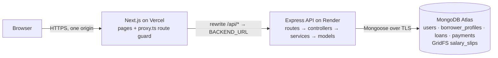
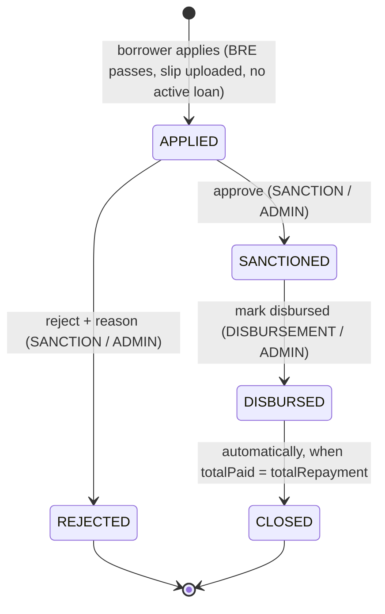
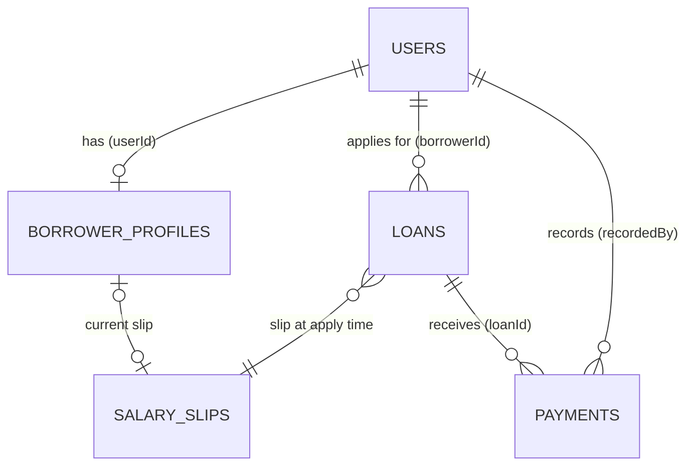

# Loan Management System

A lending platform where borrowers apply for a personal loan online, and internal teams (Sales, Sanction, Disbursement, Collection, Admin) move each loan through its lifecycle until it is repaid:

`APPLIED → SANCTIONED → DISBURSED → CLOSED` (or `APPLIED → REJECTED`)

|                |                                                         |
| -------------- | ------------------------------------------------------- |
| **Web app**    | https://loan-management-system-beta-pearl.vercel.app    |
| **API health** | https://loan-management-system-wl8j.onrender.com/health |
| **Demo video** | _link added at submission_                              |

> The API runs on Render's free tier, which sleeps after about 15 minutes idle. The first request can take up to a minute; the app shows a "Waking up the server" banner while it retries.

## Demo accounts

Every seeded account uses the password **`Password@123`**.

| Email                                                | Role / state                                                                  |
| ---------------------------------------------------- | ----------------------------------------------------------------------------- |
| `admin@lms.dev`                                      | ADMIN: every module, the overview and Staff management                        |
| `sales@lms.dev`                                      | SALES                                                                         |
| `sanction@lms.dev`                                   | SANCTION                                                                      |
| `disbursement@lms.dev`                               | DISBURSEMENT                                                                  |
| `collection@lms.dev`                                 | COLLECTION                                                                    |
| `borrower@lms.dev`                                   | BORROWER: fresh, to walk the whole application                                |
| `lead.new@lms.dev`                                   | BORROWER: registered, no details yet (Sales lead)                             |
| `lead.brefail@lms.dev`                               | BORROWER: failed the eligibility check (age 21, unemployed)                   |
| `lead.noslip@lms.dev`                                | BORROWER: eligible, no salary slip yet                                        |
| `lead.ready@lms.dev`                                 | BORROWER: eligible with a slip, hasn't applied                                |
| `demo.applied1@lms.dev`, `demo.applied2@lms.dev`     | BORROWER: loan APPLIED (Sanction queue)                                       |
| `demo.sanctioned@lms.dev`                            | BORROWER: loan SANCTIONED (Disbursement queue)                                |
| `demo.disbursed1@lms.dev`, `demo.disbursed2@lms.dev` | BORROWER: loan DISBURSED (Collection queue; the second has a partial payment) |
| `demo.rejected@lms.dev`                              | BORROWER: loan REJECTED, with a reason                                        |
| `demo.closed@lms.dev`                                | BORROWER: loan CLOSED (fully repaid)                                          |

This is a demo with shared, published credentials: please don't enter real personal data or documents.

**More test data:** `npm run seed -- --test-data` adds 60 removable `@test.lms.dev` accounts (password `Test@1234`), so every role sees at least 5 records after login. Borrowers each have 5 loans, and there are 10 Sales leads. Accounts, per-borrower loans, an RBAC checklist and a suggested walkthrough are in **[docs/TEST_ACCOUNTS.md](docs/TEST_ACCOUNTS.md)**.

## Features

**Borrower portal** (`/apply`): a wizard that resumes at the borrower's last completed step.

1. **Sign up / log in.** Passwords are hashed with bcrypt; the session is an httpOnly cookie.
2. **Personal details + eligibility check (BRE).** A live preview runs as you type, but the server decides and lists **every** failed rule at once.
3. **Salary slip upload.** PDF, JPG or PNG up to 5 MB. The file's real type is checked from its bytes, and it's stored in MongoDB GridFS.
4. **Loan configuration.** Sliders for ₹50,000–₹5,00,000 and 30–365 days, with a live calculation panel (12% p.a. simple interest). They work with the keyboard and screen readers.
5. **Apply → status page** with amounts, the outstanding balance, a timeline and the rejection reason. "Apply again" appears after a rejected or closed loan.
6. **My loans** (`/apply/loans`): every loan the borrower has applied for, newest first, each opening its own timeline.

**Operations dashboard** (`/dashboard`). Each role sees only its module; Admin sees everything.

| Module       | Who                 | What                                                                                                                                                                                                                                                           |
| ------------ | ------------------- | -------------------------------------------------------------------------------------------------------------------------------------------------------------------------------------------------------------------------------------------------------------- |
| Sales        | SALES, ADMIN        | Registered borrowers who haven't applied, with their stage (details pending / not eligible / slip pending / ready)                                                                                                                                             |
| Sanction     | SANCTION, ADMIN     | APPLIED loans → review the applicant, BRE result and salary slip (inline viewer) → **Approve** or **Reject with a reason**                                                                                                                                     |
| Disbursement | DISBURSEMENT, ADMIN | SANCTIONED loans → **Mark disbursed** (confirm dialog)                                                                                                                                                                                                         |
| Collection   | COLLECTION, ADMIN   | DISBURSED loans → record payments (unique UTR, amount, date); the loan **auto-closes** when fully repaid                                                                                                                                                       |
| Overview     | ADMIN               | Counts per status, plus every loan with a status filter                                                                                                                                                                                                        |
| Staff        | ADMIN               | Every user with their role (search, role filter); **add staff members** with a temporary password and **change roles**, with safety rules: an admin can't change their own role, the last admin can't be demoted, and a borrower with loans can't become staff |

## Tech stack

| Part     | Tech                                                                                                     | Hosting        |
| -------- | -------------------------------------------------------------------------------------------------------- | -------------- |
| Frontend | Next.js 16 (App Router), React 19, TypeScript 6, Tailwind CSS 4, zod, jose, sonner                       | Vercel         |
| Backend  | Node 24, Express 5, TypeScript 6 (ESM), Mongoose 9, zod 4, jose, bcrypt, helmet, multer, file-type, pino | Render         |
| Database | MongoDB Atlas 8.0 (salary slips in GridFS)                                                               | Atlas M0       |
| Tests    | vitest, supertest, mongodb-memory-server (replica set, for transactions)                                 | GitHub Actions |

## Architecture



- **Same-origin API.** The browser only talks to the Vercel domain, and Next.js rewrites proxy `/api/*` to Render. The JWT cookie is therefore first-party (`httpOnly; Secure; SameSite=Lax`) with no cross-site cookie problems.
- **Backend layering:** `routes → controller (HTTP only) → service (business logic) → model`. Services throw a typed `AppError`, and one error handler formats every error as `{ success: false, error: { code, message, details? } }`. Successes are `{ success: true, data }`.
- **Business rules are pure, unit-tested functions:** `utils/bre.ts`, `loan-math.ts`, `loan-state-machine.ts`, `payment-rules.ts`. The BRE and loan math are mirrored in `frontend/src/lib` and tested against the **same JSON test vectors** as the server.
- **RBAC is enforced on the backend for every route.** The frontend route guard (`proxy.ts`) and the role-filtered sidebar are UX only.

More detail: [docs/ARCHITECTURE.md](docs/ARCHITECTURE.md).

## Loan lifecycle



- **Single source of truth:** `backend/src/utils/loan-state-machine.ts`. An invalid transition returns **409**.
- **Race-safe:** each transition is one conditional update (`{ _id, status: from }`).
- **One active loan:** a borrower can have at most one APPLIED / SANCTIONED / DISBURSED loan, enforced by a partial unique index. Every loan stores a `statusHistory` of `{ from, to, by, byRole, at, note }`.

## Business rules

**Eligibility (BRE).** The server is the source of truth, and the rules run again when the borrower applies, because age changes over time. A failure returns **422** with all failed rules.

| Rule       | Fails when                                                                                         |
| ---------- | -------------------------------------------------------------------------------------------------- |
| Age        | not 23–50 inclusive, from the exact date of birth (birthday passed or not; calendar date in India) |
| Salary     | monthly salary below ₹25,000                                                                       |
| PAN        | doesn't match `^[A-Z]{5}[0-9]{4}[A-Z]$` after trimming and uppercasing                             |
| Employment | unemployed                                                                                         |

Why server _and_ client: the client mirror gives instant feedback, but anyone can call the API directly, so only the server's decision counts ([DECISIONS #21](docs/DECISIONS.md)).

**Loan math.** All money is stored as integer **paise**.

- `SI = round((P × 12 × T) / (365 × 100))`, with T in days; `totalRepayment = P + SI`.
- The server recalculates on apply and rejects client-sent totals.
- Example: ₹1,00,000 for 90 days → interest **₹2,958.90**, total **₹1,02,958.90**.

**Payments.**

- The UTR is unique: trimmed, uppercased, unique index; a duplicate → **409**.
- The amount must be > 0 and ≤ outstanding (`totalRepayment − totalPaid`). The date can't be in the future or before disbursal. The loan must be DISBURSED.
- The payment insert, the `totalPaid` increment and the auto-close happen in **one MongoDB transaction**. Concurrent payments can never overpay (tested).

## Data model



| Collection                   | Key fields                                                                                                                                                                                                  | Indexes                                                                                                      |
| ---------------------------- | ----------------------------------------------------------------------------------------------------------------------------------------------------------------------------------------------------------- | ------------------------------------------------------------------------------------------------------------ |
| `users`                      | name, email, passwordHash (`select: false`), role                                                                                                                                                           | `email` unique; `{ role, createdAt, _id }`                                                                   |
| `borrower_profiles`          | userId, fullName, pan, dateOfBirth, monthlySalary (paise), employmentMode, breResult, salarySlip                                                                                                            | `userId` unique                                                                                              |
| `loans`                      | borrowerId, principal, tenureDays, annualInterestRate, simpleInterest, totalRepayment, totalPaid, status, applicant snapshot, salarySlip snapshot, rejectionReason, disbursedAt/By, closedAt, statusHistory | `{ status, createdAt, _id }`; `{ borrowerId, createdAt, _id }`; **partial unique `borrowerId` while active** |
| `payments`                   | loanId, utr, amount (paise), paymentDate, recordedBy                                                                                                                                                        | `utr` unique; `{ loanId, paymentDate, _id }`                                                                 |
| `salary_slips.files/.chunks` | GridFS; generated filename, `metadata: { ownerId, contentType }`                                                                                                                                            | GridFS defaults                                                                                              |

The applicant's details and salary slip are **snapshotted onto the loan** at apply time, so later profile edits don't rewrite an application.

## API

Base path `/api/v1`. Full request and response shapes and every error code are in **[docs/API.md](docs/API.md)**.

| Method    | Path                                               | Roles                                                                      |
| --------- | -------------------------------------------------- | -------------------------------------------------------------------------- |
| GET       | `/health` (unversioned)                            | public                                                                     |
| POST      | `/auth/signup` · `/auth/login` · `/auth/logout`    | public (rate-limited)                                                      |
| GET       | `/auth/me`                                         | any logged-in user                                                         |
| GET       | `/borrower/progress`                               | BORROWER                                                                   |
| PUT       | `/borrower/profile`                                | BORROWER                                                                   |
| POST, GET | `/borrower/salary-slip`                            | BORROWER                                                                   |
| POST      | `/borrower/loans`                                  | BORROWER                                                                   |
| GET       | `/borrower/loans` · `/borrower/loans/:loanId`      | BORROWER (own loans only)                                                  |
| GET       | `/loans` · `/loans/:loanId`                        | SANCTION, DISBURSEMENT, COLLECTION, ADMIN (scoped to each module's status) |
| POST      | `/loans/:loanId/approve` · `/loans/:loanId/reject` | SANCTION, ADMIN                                                            |
| POST      | `/loans/:loanId/disburse`                          | DISBURSEMENT, ADMIN                                                        |
| GET       | `/loans/:loanId/salary-slip`                       | SANCTION, ADMIN                                                            |
| GET, POST | `/loans/:loanId/payments`                          | COLLECTION, ADMIN                                                          |
| GET       | `/leads`                                           | SALES, ADMIN                                                               |
| GET       | `/dashboard/summary`                               | ADMIN                                                                      |
| GET, POST | `/admin/users`                                     | ADMIN                                                                      |
| PATCH     | `/admin/users/:userId/role`                        | ADMIN                                                                      |

Status codes: 400 validation · 401 not logged in · 403 wrong role · 404 · 409 conflict · 413 too large · 415 file type · 422 business rule (BRE / payment) · 429 rate limited. Every list is paginated (`?page&limit`).

## Security

RBAC on every route, with a test matrix covering **21 protected endpoints × 7 identities**. Admin-only staff management with lock-out and segregation-of-duties rules. Also: IDOR-safe borrower routes, strict zod schemas, NoSQL-injection guards, magic-byte upload checks, an httpOnly cookie session, rate limits, an Origin check, helmet, and redacted logs. The full review against the project rules, the test evidence and the known limitations are in **[docs/SECURITY.md](docs/SECURITY.md)**.

## Project structure

```
backend/
  src/
    config/       env (zod), db, constants, logger
    middleware/   authenticate, require-role, validate, verify-origin, rate-limit, upload, error-handler
    modules/      auth, borrower, loans, payments, uploads, dashboard, health
                  (*.routes.ts → *.controller.ts → *.service.ts, *.schema.ts, *.dto.ts)
    models/       user, borrower-profile, loan, payment
    utils/        bre, loan-math, loan-state-machine, payment-rules, dates, pan, jwt, …
    scripts/      seed CLI, demo data, test-data/ (the removable @test.lms.dev QA data)
    app.ts        createApp(): Express app without listen (testable)
    server.ts     connect → build indexes → listen
  tests/          unit/, integration/, fixtures/ (shared BRE + loan-math vectors), helpers/
frontend/src/
  app/            (auth)/login|signup, (borrower)/apply/…, dashboard/…, forbidden, not-found
  components/     ui/, borrower/, dashboard/, auth/
  lib/            api-client, route-access, bre, loan-math, wizard, format, dates
  hooks/, types/
  proxy.ts        role-aware route guard (Next 16's renamed middleware)
docs/             API, ARCHITECTURE, DECISIONS, DEPLOYMENT, SECURITY
```

## Local setup

**Prerequisites:** Node 24 (`nvm use`) and npm 11. There is no local MongoDB: the app uses a free Atlas cluster with an `lms_dev` database ([docs/DEPLOYMENT.md](docs/DEPLOYMENT.md), steps 1–2). Tests use an in-memory MongoDB and never touch Atlas.

1. Install dependencies. The root install only adds git hooks and Prettier.

   ```bash
   npm install
   ```

   ```bash
   npm install --prefix backend
   ```

   ```bash
   npm install --prefix frontend
   ```

2. Configure the backend: copy the example, then set `MONGODB_URI` (`…/lms_dev?…`) and `JWT_SECRET` (`openssl rand -base64 48`). Every variable is validated at startup.

   ```bash
   cp backend/.env.example backend/.env
   ```

3. Configure the frontend: `BACKEND_URL=http://localhost:4000`, and the **same** `JWT_SECRET` as the backend.

   ```bash
   cp frontend/.env.example frontend/.env.local
   ```

4. Seed the demo accounts and data. It's safe to re-run: it resets the demo accounts and never touches other users.

   ```bash
   npm run seed --prefix backend
   ```

   Optionally add the QA data from [docs/TEST_ACCOUNTS.md](docs/TEST_ACCOUNTS.md) (`--remove-test-data` takes it out again):

   ```bash
   npm run seed --prefix backend -- --test-data
   ```

5. Run the API on http://localhost:4000 and the web app on http://localhost:3000, in two terminals:

   ```bash
   npm run dev --prefix backend
   ```

   ```bash
   npm run dev --prefix frontend
   ```

## Tests and quality checks

Run from the repository root; each command runs in both apps:

```bash
npm test
```

```bash
npm run lint
```

```bash
npm run typecheck
```

```bash
npm run build
```

```bash
npm run secrets
```

- **Backend: 477 tests.**
  - Unit: BRE, loan math, state machine, payment rules, dates, JWT, env, log redaction, cookie flags.
  - Integration (supertest + in-memory replica set): auth, profile/BRE, uploads, apply, sanction/disbursement/collection, the payment transaction incl. concurrency, leads/summary, borrower loan history, staff management (each safety rule, plus two admins demoting each other at once), the **147-cell RBAC matrix**, an IDOR / injection / mass-assignment suite, and the test-data seed (consistency, idempotency, safe removal, and a login as each of the 60 test accounts).
- **Frontend: 78 tests:** BRE and loan-math mirrors (shared vectors), route access and safe redirects, wizard redirects, formatting.
- **CI** (GitHub Actions) on every PR: lint, typecheck, test, build and `npm audit` for each app, a full-history gitleaks scan, and a Conventional-Commit PR title check. `main` is protected and requires these checks.

## Deployment

| Piece    | Service                                                 | Notes                                                                                                                                                  |
| -------- | ------------------------------------------------------- | ------------------------------------------------------------------------------------------------------------------------------------------------------ |
| Database | MongoDB Atlas M0 (AWS Singapore)                        | network access `0.0.0.0/0` (Render free has no static IPs); separate dev and prod databases                                                            |
| API      | Render web service from `render.yaml` (free, Singapore) | `rootDir: backend`; build `npm ci --include=dev && npm run build`; start `node dist/server.js`; health check `/health`; deploys `main` after CI passes |
| Web app  | Vercel (root directory `frontend`)                      | `BACKEND_URL` and `JWT_SECRET` (Production only); builds `main` only                                                                                   |

Production is seeded from a laptop, because Render's free tier has no shell:

```bash
cd backend && MONGODB_URI='<prod connection string>' NODE_ENV=production npm run seed -- --force
```

The optional test data uses the same command with `--test-data` (or `--remove-test-data`) added; see [docs/DEPLOYMENT.md](docs/DEPLOYMENT.md#test-data-in-production).

Step-by-step instructions (Atlas, Render, Vercel, env vars, post-deploy checks) are in **[docs/DEPLOYMENT.md](docs/DEPLOYMENT.md)**.

## Engineering process

- **GitHub Flow:** short-lived branches, squash-merged PRs into a protected `main`, built in 8 PRs (see [PROGRESS.md](PROGRESS.md)).
- **Conventional Commits:** enforced by commitlint (husky); lint-staged runs ESLint and Prettier on commit.
- **Every PR runs the Definition of Done** from [CLAUDE.md](CLAUDE.md): lint, typecheck, tests, build, audit, secret scan and a security self-review.
- **Design decisions** and their reasons are recorded in [docs/DECISIONS.md](docs/DECISIONS.md). The original design is in [PLAN.md](PLAN.md).

## Known limitations

- **Shared demo credentials**, published on purpose for evaluation.
- **Free-tier cold starts** on Render: the first request can take about a minute.
- **Stateless JWT:** logout clears the cookie, but a stolen token stays valid until it expires (1 day).
- **Sign-up reveals registered emails** (409), mitigated by rate limits.
- **Rate-limit accuracy depends on `TRUST_PROXY_HOPS`**, which must be measured on the deployed proxy chain.
- **"One active loan" is per account,** not per PAN.

Details and mitigations: [docs/SECURITY.md](docs/SECURITY.md#known-limitations).

## Future work

- **Production improvements:** separate staff portal/domain, SSO and mandatory 2FA for staff, IP allowlisting. Today there is one login page for every role, on purpose: the evaluator can sign in with any seeded account straight away.
- **Accounts:** a change-password and password-reset flow, so admin-created staff can replace their temporary password.
- **Sessions:** re-issue the session cookie after a role change, so the user doesn't have to log in again to see their new dashboard.
