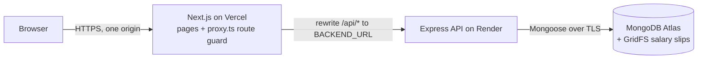

# Architecture

- The browser only talks to the Vercel domain. Next.js rewrites proxy `/api/*` to the backend, so the JWT cookie is first-party (`httpOnly`, `SameSite=Lax`, `Secure`).
- Only the backend talks to MongoDB. Uploaded salary slips are stored in GridFS because Render's disk is ephemeral.

## Backend layering

`routes → controller (HTTP only) → service (business logic) → model`

- Controllers never touch Mongoose; services never touch `req` / `res`.
- Services throw typed `AppError(statusCode, code, message)`; one central error handler formats every error response.
- Business rules (BRE, loan math, status machine, payment rules) are pure functions in `src/utils/` with unit tests.

## Frontend

- App Router pages; data is fetched on the client through `lib/api-client.ts` (same-origin `/api/...`).
- `proxy.ts` guards routes by role for UX; the API enforces every rule again.

Details are filled in as each branch lands; the full design is in [PLAN.md](../PLAN.md).
