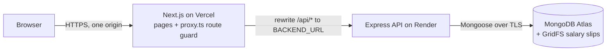

# Architecture

- **One origin for the browser.** The browser only talks to the Vercel domain, and Next.js rewrites proxy `/api/*` to the backend. The JWT cookie is therefore first-party (`httpOnly`, `SameSite=Lax`, `Secure`), and CORS is only a safety net.
- **Only the backend talks to MongoDB.** Uploaded salary slips are stored in GridFS, because Render's disk is ephemeral.
- **The rewrite is a plain proxy, not a Vercel Function,** so the 4.5 MB Function body limit doesn't apply. Uploads keep the 5 MB limit.

## Backend

### Request pipeline

Every request passes through the same steps, in order (`src/app.ts`):

1. `helmet`, CORS allowlist, `trust proxy` (`TRUST_PROXY_HOPS`), pino-http logging (secrets redacted), `Cache-Control: no-store`
2. `verifyOrigin`: POST, PUT, PATCH or DELETE from a foreign `Origin` → 403 `INVALID_ORIGIN`
3. `express.json({ limit: '100kb' })` and the cookie parser
4. Router: `authenticate` (401) → `requireRole(...)` (403) → `validate(schema)` (400) → controller
5. Controller → service. A service throws `AppError` (404 / 409 / 422) or returns data.
6. `errorHandler`: one envelope for every error; unknown errors become a generic 500

The role check runs **before** validation and any lookup, so an unauthorised caller can't learn whether a resource exists.

### Layers

`routes → controller (HTTP only) → service (business logic) → model`

| Layer             | Does                                                                                               | Never does          |
| ----------------- | -------------------------------------------------------------------------------------------------- | ------------------- |
| `*.routes.ts`     | wires the middleware chain and the roles for each path                                             | logic               |
| `*.controller.ts` | reads the validated input and `req.user`, calls one service, sends the response with `sendSuccess` | touch Mongoose      |
| `*.service.ts`    | business rules, queries, transactions; throws `AppError`                                           | touch `req` / `res` |
| `*.dto.ts`        | turns documents into response shapes (masks the PAN, drops staff ids for borrowers)                | queries             |
| `models/`         | schemas and indexes                                                                                | business rules      |
| `utils/`          | pure functions: BRE, loan math, state machine, payment rules, dates, PAN                           | I/O                 |

### Modules (`src/modules/`)

| Module      | Endpoints                                                                             | Notes                                                                                 |
| ----------- | ------------------------------------------------------------------------------------- | ------------------------------------------------------------------------------------- |
| `auth`      | signup, login, logout, me                                                             | bcrypt, a generic login error with equal timing, three rate limits                    |
| `borrower`  | progress, profile                                                                     | saving the profile runs the BRE (422 lists every failure; the profile is still saved) |
| `uploads`   | borrower slip upload/download, loan slip download                                     | multer memory storage → type check (extension + MIME + magic bytes) → GridFS          |
| `loans`     | apply, the borrower's own loan history; staff list, detail, approve, reject, disburse | each transition is one conditional `findOneAndUpdate({ _id, status: from })`          |
| `payments`  | list, record                                                                          | one MongoDB transaction: insert payment, `$inc totalPaid`, auto-close                 |
| `dashboard` | leads, summary                                                                        | aggregations; leads are borrowers with no loan yet                                    |
| `health`    | `GET /health`                                                                         | pings the database (2 s cap), 503 when it's down                                      |

### Key rules and where they live

- **Status machine:** `utils/loan-state-machine.ts` (`LOAN_ACTIONS`: the allowed roles, `from`, `to`). Routes take their roles from here, so the rules can't drift.
- **Module scoping:** `MODULE_OWNED_STATUS` maps SANCTION → APPLIED, DISBURSEMENT → SANCTIONED, COLLECTION → DISBURSED. A staff read outside a module's status is a 404; ADMIN sees everything.
- **One active loan per borrower:** a pre-check gives a friendly 409, and a partial unique index on `borrowerId` (while APPLIED / SANCTIONED / DISBURSED) makes it race-safe.
- **Duplicate keys:** `isDuplicateKeyError(error, field)` maps MongoDB E11000 per index (`email`, `utr`, `borrowerId`) to a clear 409 code.
- **Snapshots:** at apply time the loan copies the applicant's details and the salary slip reference, so later profile edits don't change an application.

## Frontend

- **App Router; data loaded in the browser.** Pages fetch through `lib/api-client.ts` (same-origin `/api/v1/...`) using the `useApiQuery` hook. The client unwraps the envelope and throws `ApiError`.
  - On `UNAUTHENTICATED` it sends the user to login, and on `FORBIDDEN` to the 403 page.
  - GETs retry while Render wakes up, with a banner.
- **Route guard (`src/proxy.ts`).** Next 16's renamed middleware verifies the session JWT with the shared secret and applies `resolveRouteAccess`: anonymous → login, a wrong role → 403 page, logged-in users skip login. It fails closed. This is UX only; the API enforces every rule again.
- **Borrower wizard (`/apply/*`).** `getWizardRedirect` sends the borrower to the right step from `/borrower/progress`. Steps are locked while a loan is active.
- **Mirrored business logic.** `lib/bre.ts` and `lib/loan-math.ts` mirror the backend for instant feedback. They're tested against the backend's JSON vectors (`backend/tests/fixtures/`), so they can't drift. The server's answer always wins.
- **Dashboard (`/dashboard/*`).** A shell with a role-filtered sidebar; each module is one component (`SanctionModule`, `DisbursementModule`, `CollectionModule`, `SalesModule`, `AdminOverview`). They share `LoanQueue` (a table, with cards on phones), `LoanFacts` and `SalarySlipViewer`.

## Testing approach

- **Unit:** pure rules (BRE, loan math, state machine, payment rules, dates) plus config, JWT, cookie flags and log redaction.
- **Integration:** `createApp()` with supertest against `mongodb-memory-server` as a **replica set**, because payments use transactions. Collections are cleared between tests, and nothing touches Atlas.
- **RBAC matrix:** every protected endpoint × every identity.
- **Shared vectors:** the BRE and loan-math JSON fixtures run in both apps.

The original design and its reasoning are in [PLAN.md](../PLAN.md); individual decisions are in [DECISIONS.md](DECISIONS.md).
